# LeafMachine3

**Automated trait extraction from herbarium specimen images.** LeafMachine3 is a modular suite of
machine learning and computer vision tools that locates, isolates, and measures the plant and
archival components of a digitized specimen: every leaf is segmented, landmarked, oriented, and
measured; every ruler is read for a pixel-to-metric conversion factor; every label, barcode, and
color card is cropped for downstream work. Each run produces annotated overlays, per-leaf cutouts, and a CSV with one row per leaf.

[](LICENSE)
[](pyproject.toml)
[](https://huggingface.co/phyloforfun)
[](https://leafmachine.org)

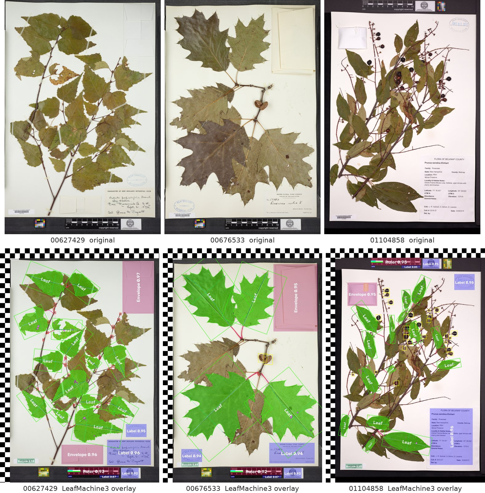

*Three specimens as imaged (top) and the LeafMachine3 summary overlay for each (bottom): leaf
masks, rotated bounding boxes, landmarks, petiole widths, organ and archival detections. All demo
images in this README come from these three sheets, Platanus kerrii, Catalpa erubescens and
Catalpa purpurea, which ship in `examples/images/`, so running LM3 on the bundled examples
reproduces every figure.*

---

## Table of Contents

- [About LeafMachine3](#about-leafmachine3)
- [Installation](#installation)
  - [Requirements](#requirements)
  - [Install](#install)
  - [Verify](#verify)
  - [Troubleshooting](#troubleshooting)
  - [Docker](#docker)
  - [Updating](#updating)
- [Quick Start](#quick-start)
  - [Run from the GUI](#run-from-the-gui)
  - [Electron desktop app](#electron-desktop-app)
  - [Run from the command line](#run-from-the-command-line)
  - [Where results land](#where-results-land)
- [Workflow](#workflow)
  - [Image resolution](#image-resolution)
  - [FieldPrism sheets](#fieldprism-sheets)
- [In-Depth: the processing modules](#in-depth-the-processing-modules)
  1. [MP Conversion Factor](#1-mp-conversion-factor)
  2. [Archival Detector](#2-archival-detector)
  3. [Plant Detector](#3-plant-detector)
  4. [Specimen Segmenter](#4-specimen-segmenter)
  5. [Phenology Detector](#5-phenology-detector)
  6. [Ruler Classifier](#6-ruler-classifier)
  7. [Ruler Conversion Factor](#7-ruler-conversion-factor)
  8. [Leaf Segmenter](#8-leaf-segmenter)
  9. [Morphology](#9-morphology)
  10. [Landmark Detector](#10-landmark-detector)
  11. [Landmark Measurements](#11-landmark-measurements)
  12. [Leaf Orientation](#12-leaf-orientation)
  13. [Petiole Width](#13-petiole-width)
  14. [Bilateral Symmetry](#14-bilateral-symmetry)
  15. [Metric Grounding](#15-metric-grounding)
  16. [Reporter](#16-reporter)
  17. [Shape (ECT)](#17-shape-ect)
  18. [Momocs Export](#18-momocs-export)
- [Module Outputs](#module-outputs)
- [Outputs](#outputs)
- [Postprocessing Tools](#postprocessing-tools)
- [Models](#models)
- [Related Projects and Citation](#related-projects-and-citation)
- [License](#license)

---

## About LeafMachine3

LeafMachine3 is the successor to [LeafMachine2](https://github.com/Gene-Weaver/LeafMachine2)
(Weaver & Smith, 2023). It keeps the design that made LeafMachine2 work, breaking a complex
problem into discrete steps the way a person would when extracting data from a specimen, and
rebuilds every step on current models and a runtime that is simpler to install and run.

- **Input:** a folder of herbarium specimen images (JPEG, PNG, TIFF). Field images and other
  digital plant data sets work too; archival detections are simply empty.
- **Output:** a per-specimen summary overlay for quality control, cropped components, per-leaf
  masks and cutouts (as mounted and oriented tip-up), and CSV tables with one row per leaf, per
  specimen, per detection, and per landmark.
- **Pipeline:** eighteen modules run in a fixed order, each one feeding the next. The first two
  detectors place bounding boxes around plant and archival components; everything downstream
  works on those crops. Every module can be switched off individually.

```
MP Conversion Factor → Archival Detector → Plant Detector → Specimen Segmenter → Phenology Detector
→ Ruler Classifier → Ruler Conversion Factor → Leaf Segmenter → Morphology → Landmark Detector
→ Landmark Measurements → Leaf Orientation → Petiole Width → Bilateral Symmetry
→ Metric Grounding → Reporter → Shape (ECT) → Momocs Export
```

**What changed from LeafMachine2**

| | LeafMachine2 | LeafMachine3 |
|---|---|---|
| Runtime | PyTorch + Detectron2 + Ultralytics | onnxruntime only; every model is an exported ONNX graph (no torch) |
| Install | conda + CUDA toolkit | `uv sync` from a lock file; CUDA libraries arrive as wheels |
| Models | bundled downloads | versioned on [Hugging Face](https://huggingface.co/phyloforfun), installed with one command |
| Interface | command line + YAML | the same YAML, plus a desktop GUI with live progress and a results browser |
| Leaf landmarks | 9 pseudo-landmarks as fixed boxes | a 31-keypoint pose skeleton (midvein trace, petiole trace, apex, base, width) |
| Leaf segmentation | Mask R-CNN + PointRend | YOLO26 instance segmentation of lamina, petiole, and holes |
| Rulers | 3-network binarization + scanline | unit-type ensemble + a tick-lattice solver, anchored by a resolution prior |
| Resume | per-batch | per-stage ledger in SQLite; rerun any stage and its dependents |

---

## Installation

### Requirements

| | |
|---|---|
| OS | Linux (tested on Ubuntu 22.04), Windows 10/11, macOS 13+ on Apple Silicon |
| Python | none to install: `uv` downloads the pinned 3.11 interpreter itself |
| NVIDIA GPU (recommended) | driver ≥ 525.60 (Linux) / 528.33 (Windows); no CUDA toolkit needed. Check with `nvidia-smi`. |
| CPU-only | supported on every platform; expect runs to be several times slower |
| Apple Silicon | supported; inference runs through the CoreML execution provider, falling back to CPU |
| Disk | About 1.7 GB for default models, plus several GB for the environment (especially GPU dependencies) and space for run outputs |

> **A GPU is optional, not required.** Pick the `cpu` or `macos` variant below and the whole
> pipeline runs unchanged, just slower. The Apple-GPU path has had far less testing than CUDA;
> if `lm3 doctor` reports the CPU provider on a Mac, the run still works.

### Install

Four commands. The environment is built from `uv.lock`, so every install gets exactly the package
versions this release was tested with.

```bash
# 1. uv (once per machine)
curl -LsSf https://astral.sh/uv/0.12.23/install.sh | sh                        # Linux / macOS
# powershell -ExecutionPolicy ByPass -c "irm https://astral.sh/uv/0.12.23/install.ps1 | iex"   # Windows

# 2. code
git clone https://github.com/Gene-Weaver/LeafMachine3.git
cd LeafMachine3

# 3. environment  (pick ONE line)
uv sync --frozen --extra gpu       # NVIDIA GPU, Linux or Windows
uv sync --frozen --extra cpu       # no GPU, any platform
uv sync --frozen --extra macos     # Apple Silicon

# 4. models (about 1.7 GB, from Hugging Face)
uv run --frozen --no-sync lm3 models install --yes
```

### Verify

```bash
uv --version                               # must print 0.12.23
uv run --frozen --no-sync lm3 doctor                            # must end with "Result: READY"
uv run --frozen --no-sync machine3 --config LM3_settings.yaml   # processes examples/images into runs/demo/
uv run --frozen --no-sync lm3 serve                             # GUI at http://127.0.0.1:8765  (Ctrl+C stops it)
```

`lm3 doctor` checks the interpreter, the lock, the hardware variant, the driver, and that a
real model binds to the accelerator. When something is wrong it prints the command that fixes it.
The first run on a new machine profiles the hardware before it starts, which adds a few minutes.

### Troubleshooting

| Symptom | Cause | Fix |
|---|---|---|
| `machine3` / `lm3 serve` exit with code **78** | the environment does not match `uv.lock` (built with pip, conda, or an old sync) | `uv sync --frozen --extra <gpu\|cpu\|macos> --reinstall` |
| `lm3 doctor` says the **driver is too old** | NVIDIA driver below 525.60 / 528.33 | update the driver, or use `--extra cpu` |
| GPU present but models run on the **CPU** | the CUDA provider failed to load | `uv run --frozen --no-sync lm3 doctor --models` names the missing library; reinstall with `--reinstall` |
| `lm3 models install` **fails to download** | no network, or Hugging Face is rate-limiting anonymous downloads | check the connection and rerun; a free Hugging Face token (`uv run --frozen --no-sync hf auth login`) lifts the anonymous rate limit |
| `lm3 models verify` reports a **hash mismatch** | a partial or stale download | `uv run --frozen --no-sync lm3 models install --force --yes` |
| **Out of GPU memory** | the hardware profile is wrong for this machine | `uv run --frozen --no-sync lm3-setup --force` to re-profile, or lower workers in `hardware_settings.yaml` |
| Only one of several GPUs should be used | | `CUDA_VISIBLE_DEVICES=0 uv run --frozen --no-sync machine3 --config LM3_settings.yaml` |
| **Offline / HPC** compute nodes | no network on the compute node | prefetch once: `lm3 models install --dest "$LM3_MODELS_DIR" --yes`; jobs set the same `LM3_MODELS_DIR` |
| None of the above | | delete `.venv/` and repeat the environment step |

Still stuck? Run `uv run --frozen --no-sync lm3 doctor` and open an issue with its full output.

### Docker

*Coming soon.* A CUDA image with the models pre-installed is planned; the `LM3_MODELS_DIR` mount
described above is the intended way to keep models out of the image.

### Updating

```bash
git checkout -- LM3_settings.yaml   # restores shipped settings; first copy personal settings to LM3_settings.local.yaml
git pull --ff-only
uv sync --frozen --extra gpu        # or cpu / macos
uv run --frozen --no-sync lm3 models install --yes     # picks up any model updates in the lock
```

---

## Quick Start

### Run from the GUI

```bash
uv run --frozen --no-sync lm3 serve
```

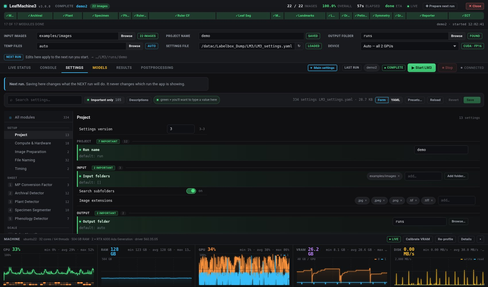

Six tabs, left to right:

| Tab | What it does |
|---|---|
| **Live Status** | per-module progress, worker fleet, throughput and ETA for the active run |
| **Console** | the run's log, streamed |
| **Settings** | every setting in `LM3_settings.yaml`, grouped by module and searchable; the pipeline order is the left rail |
| **Models** | which models are installed, verify them, pick alternates |
| **Results** | browse a finished run: overlays, crops, leaf products, and the CSV tables |
| **Postprocessing** | standalone tools that run on a finished run (STL export, leaf collage) |

Set the **input folder**, name the **project**, press **Start LM3**. The stage bar across the top
mirrors the eighteen modules and fills in as the run advances.

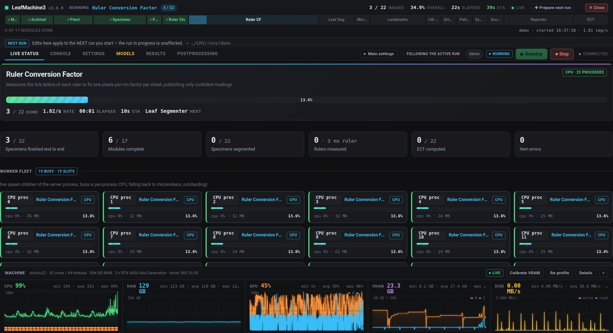

When the run finishes, the **Results** tab browses everything it wrote, by output folder, with
the run's database alongside; the **Models** tab shows which model revision each module holds
against the release lock; and **Postprocessing** holds the standalone tools.

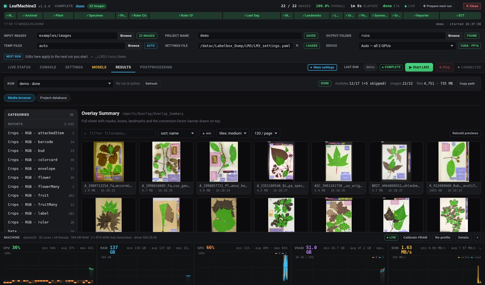

<details>
<summary>Models and Postprocessing tabs</summary>

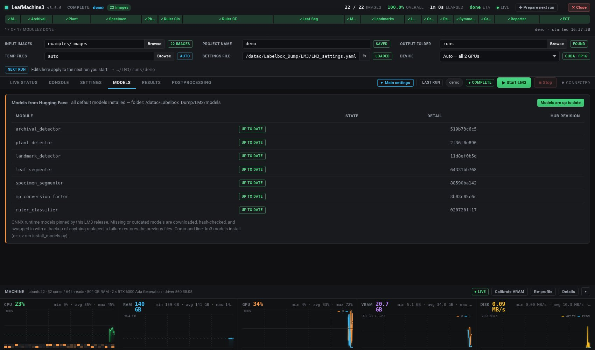

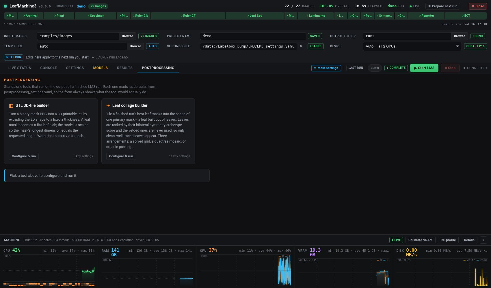

</details>

### Electron desktop app

Install the desktop group with the same hardware extra used for the pipeline (`gpu`, `cpu`, or
`macos`). It includes the pinned Node/npm and uv executables; no separate Node or Python install is
needed. After the sync, `--no-sync` keeps uv from removing the chosen hardware extra or desktop group. For example, on a CPU machine:

```bash
uv sync --frozen --extra cpu --group desktop
uv run --frozen --no-sync lm3-desktop install   # npm ci using the uv-locked Node/npm
uv run --frozen --no-sync lm3-desktop start
```

Desktop targets match the Python lock: Linux x86_64, Windows x64, and Apple Silicon (macOS 13.5+).
Build installers on their target OS and architecture; packaging uses the installed, verified Electron runtime.

For development checks and an unpacked native build:

```bash
uv run --frozen --no-sync lm3-desktop test
uv run --frozen --no-sync lm3-desktop pack
```

Python, Node/npm, and uv are pinned in `uv.lock`. Electron, electron-builder, and their JavaScript
dependencies are integrity-pinned in `app/package-lock.json`; the generated release contracts tie
both locks together, and CI verifies them before packaging. After an intentional dependency change,
update the relevant lock and run `uv run --no-sync python tools/release/write_env_contract.py`.

The packaged desktop shell uses a matching uv checkout for its backend. Set `LM3_ROOT` to that
checkout when launching it, or start that checkout's server with
`uv run --frozen --no-sync lm3 serve` first. Electron verifies the authenticated environment report
before attaching. Legacy virtual environments, Conda, `LM3_PYTHON`, and system Python are unsupported
by the desktop app. Native Windows/macOS packaging is checked in CI; release signing and native
application acceptance remain separate checks.

On Linux, `./launch_gui.sh` starts the same verified desktop command in the background; its
`status`, `stop`, and `restart` commands remain available.

### Run from the command line

```bash
uv run --frozen --no-sync machine3 --config LM3_settings.yaml                            # the whole pipeline
uv run --frozen --no-sync machine3 --config LM3_settings.yaml --run-name my_project      # name the run
uv run --frozen --no-sync machine3 --config LM3_settings.yaml --restart leaf_segmenter   # rerun one stage + everything after it
```

The settings file is the single source of truth: input folders, output folder, run name, and the
`enabled` switch of every module live in `LM3_settings.yaml`. Keep personal paths in
`LM3_settings.local.yaml`, which is ignored by Git. It is a full settings file, selected explicitly:

```bash
cp LM3_settings.yaml LM3_settings.local.yaml   # once, then edit this copy
uv run --frozen --no-sync machine3 --config LM3_settings.local.yaml
```

### Where results land

```
runs/<run_name>/
  <run_name>.sqlite          every result, queryable
  reports/
    Overlay/                 summary overlays + per-leaf landmark / petiole overlays   (start here for QC)
    Leaf_Original/           7 per-leaf products, as mounted
    Leaf_Oriented/           the same 7 products, rotated tip-up
    Crops/                   RGB crops of every non-leaf detection (rulers, labels, fruits, ...)
    Specimen_Masks/          whole-sheet and per-leaf binary masks and RGB cutouts
    Leaf_Data/               bilateral symmetry panels, ECT images and coordinates
    Leaf_Momocs/             every leaf as a Momocs-ready image, plus outlines for the R packages Momocs and Momocs2
    Data/                    the numbers: leaf_measurements.csv is the one to open first
  logs/
```

---

## Workflow

The GUI is organized top-to-bottom the way a run proceeds; this section follows it.

**Project.** Input folders (recursive by default), image extensions, output folder, run name.
Everything a run writes goes to `<output>/<run_name>/`.

**Compute & Hardware.** Which GPUs to use, precision, and the hardware profile. The profile
(`hardware_settings.yaml`) is written automatically the first time LeafMachine3 runs on a machine:
it measures how many workers each stage can hold in VRAM and RAM. Rerun it with
`uv run --frozen --no-sync lm3-setup --force` after a hardware change.

**Image Preparation.** Originals are never modified. Each image is read once, converted to RGB,
and, if its long side exceeds the working limit, downsampled into a working copy that every
module measures on. Every pixel value in the outputs is in that working frame; `work_scale` on
every row converts back.

**Modules.** The eighteen modules in pipeline order, each with an **Enabled** switch and its own
settings. Disabled modules are marked complete without doing work; enabled downstream modules
still run, but may have no inputs. Turn off dependent modules too when you do not need them.

**Reporter.** Which files to write, in which formats, and the overlay palette. Every output folder
toggles independently; the defaults draw everything.

**Resume and rerun.** Progress is a per-stage ledger in the run's SQLite database. Starting the
same run name again picks up where it stopped; `--restart <stage>` discards one stage's results
and everything downstream of it, then reruns them.

### Image resolution

LeafMachine3 accepts any input resolution. On ingest each image is read once. An RGB JPEG whose
long side is at or under `ingest.max_working_dim` (default 3200 px) is used as-is; anything
larger, or in another format, is converted to RGB JPEG and downsampled (Lanczos, at
`ingest.jpg_quality`) into a working copy under the run's `_tmp_original/`. Originals are never
modified. Every module measures on the working copy, so a 50 MP scan and a 6 MP photo are
processed at the same working size. The 3200 px default is a speed tradeoff: at that size a
herbarium sheet typically carries enough detail for every module without a dramatic increase in
processing time. A larger limit is worth trying when the leaves are particularly small or you
want to detect tiny flowers or buds, but it increases processing time and may need more VRAM
and RAM than the default hardware profile allows.

Everything LeafMachine3 writes is in that **working frame**: every `_px` column, every box in a
filename, and every overlay, mask, and crop under `reports/`. The Reporter never upscales back
to the original; an overlay inflated by the downsample factor would show detail that was never
measured. To return to original pixels, divide by `work_scale`, stored on every row (1.0 when no
downsampling happened) next to `original_width` and `original_height`. The ruler conversion
factor is reported in both frames, and `_cm` values are frame-independent.

### FieldPrism sheets

[FieldPrism](https://fieldprism.org/) ([iOS](https://apps.apple.com/us/app/fieldprism/id6761267750),
[Android](https://play.google.com/apps/testing/com.leafmachine.fieldprism)) photographs plants on a
printed field sheet with a photogrammetric marker near each corner, then rectifies the photo so
the sheet is square to the camera. FieldPrism is described in this publication but has been updated since. The Android and iOS apps replace the apparatus described in the paper.

> Weaver, W. N., and S. A. Smith (2023),
> FieldPrism: A system for creating snapshot vouchers from field images using photogrammetric
> markers and QR codes, *Applications in Plant Sciences* 11(5): e11545,
> <https://doi.org/10.1002/aps3.11545>

LeafMachine3 reads the app's processed images directly.
Put the app's rectified output (the `FPfit` images) in your input folder; nothing needs
configuring.

Each marker is a 3 × 3 grid of 1 cm cells with four filled squares, top-left (TL), top-right (TR),
center (C) and bottom-left (BL), and an empty bottom-right (BR) cell. The archival detector finds
the markers as rulers, the ruler classifier labels them `FP`, and the Ruler Conversion Factor
stage measures them:

- **Rectified images only.** LeafMachine3 does not warp or deskew anything; it assumes the
  FieldPrism app already did. An angled photo of a field sheet will measure wrong.
- **Each marker is its own ruler.** The squares are found and labeled TL, TR, C and BL exactly
  the way the FieldPrism app does it, the empty BR cell is predicted (TR + BL − TL), and the
  geometry is checked: equal arms, a right angle, C in the middle. A marker's factor is the
  app's, the mean TL→TR and TL→BL center spacing over 2 cm. The markers on a sheet are compared
  like several rulers on one sheet, and a marker that disagrees with the others is rejected.
- **The sheet size is identified from where the markers sit.** FieldPrism prints A5, A4, A3,
  Letter, Legal and Tabloid sheets, and the exact layout of each, taken from the FieldPrism
  sheet builder, is stored in `leafmachine3/inference/ruler_lattice/fieldprism_sheets.json`.
  Two, three or four markers are enough: the missing BR cell gives each marker's orientation,
  so the sheet's top-left corner is always known, even in a rotated image, and a
  marker that is missing or unreadable is reconstructed from the layout ("inferred"). A lone pair
  that two sizes share (a top pair is 146 mm apart on both Letter and Legal) is reported as
  ambiguous unless the image extent settles it.
- **The factor comes from the sheet, never from the megapixel prediction.** FieldPrism sheets
  come in several sizes, so the stage 1 prediction is not used on them at all, not even as a
  fallback. The published factor is the whole-sheet fit when the size is identified (markers 8
  to 41 cm apart, far steadier than one marker's 2 cm), otherwise the agreeing markers' mean, with
  `cf_source` = `measured_from_fieldprism`. Ordinary rulers on the same sheet are still read and
  count as corroboration when they agree within `fieldprism.anchor_tol` (3%), but they never
  change the value. Markers that disagree with each other give no FieldPrism factor; the sheet
  then publishes only if its ordinary rulers agree among themselves.

On the summary overlay, FieldPrism markers are drawn the way the app draws them instead of as
detector boxes: TL red, TR yellow, C cyan, BL white, the empty BR cell filled green, and each
marker's own "1 cm = N px". A reconstructed marker is dashed in magenta. The sheet size sits in
the top-left corner next to the 1 cm / 1 inch raft.

<table>
  <tr><td align="center">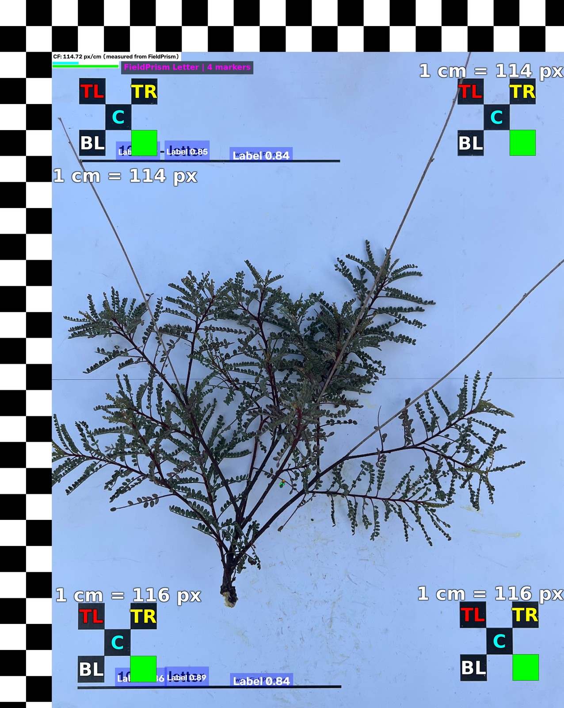<br><sub>All four markers read: Letter, 114.72 px/cm</sub></td><td align="center">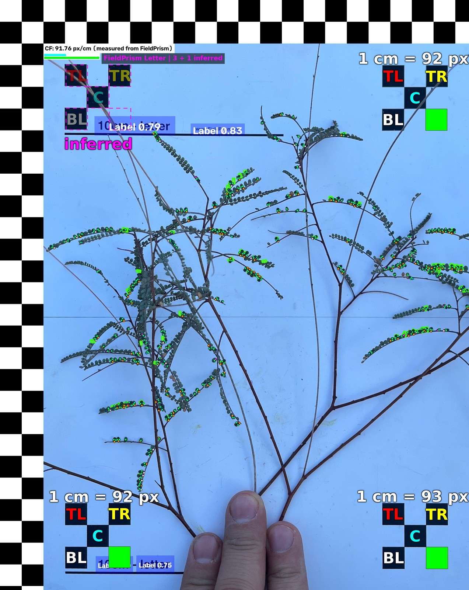<br><sub>Top-left marker crossed by twigs, so it is reconstructed: Letter, 91.76 px/cm</sub></td></tr>
  <tr><td align="center">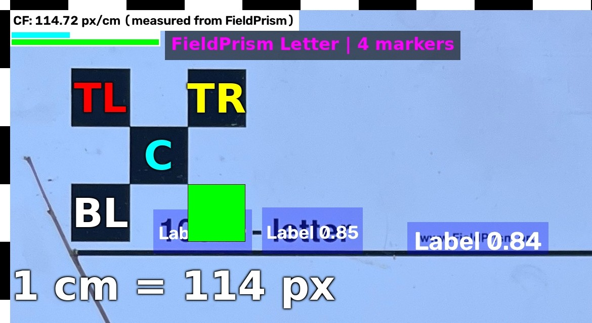</td><td align="center">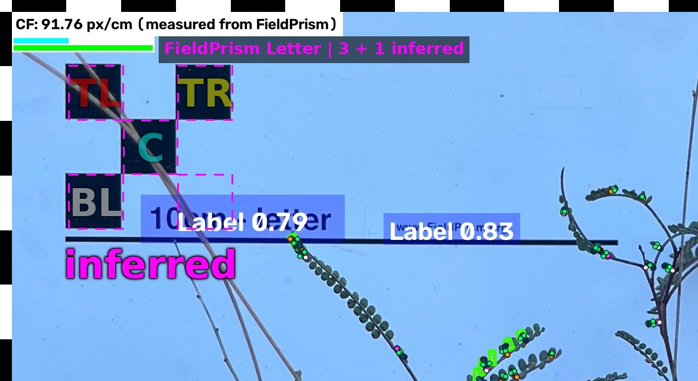</td></tr>
</table>

Other outputs:

- **`Overlay/Overlay_FieldPrism/`**: the image labeled exactly like the FieldPrism app's own
  overlay, with its "1 cm = N px" legend and the sheet size.
- **`Overlay/Overlay_Ruler_Lattice/`**: one QC panel per marker (the checks and the verdict) and a
  to-scale schematic of the sheet with the ranked size candidates.
- **CSV**: `fieldprism_markers.csv` (one row per marker: the TL, TR, C, BL and predicted BR square
  centers, spacing, px/cm, checks, verdict) and `fieldprism_sheets.csv` (one row per sheet: size,
  orientation, markers used and inferred, the fit, the factor). `specimen_summary.csv` and
  `leaf_measurements.csv` add `fp_sheet_type`, `fp_sheet_status`, `fp_orientation_deg`,
  `fp_n_markers_detected`, `fp_n_markers_used`, `fp_n_markers_inferred`, `fp_cf_px_per_cm`,
  `fp_confidence` and `ruler_cf_anchor_source`. The settings that turn the two FieldPrism CSV
  files on or off are not in the FieldPrism settings group; they are under **Reporter › Data
  export (CSV)**, alongside the other CSV files.

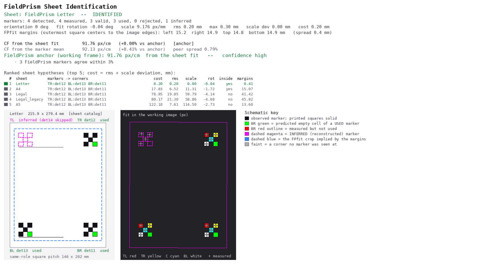

In the Settings tab these live under **Scale › Ruler Conversion Factor › FieldPrism**:

| Setting | Default | What it does |
|---|---|---|
| `modules.ruler_cf.fieldprism.enabled` | `true` | measure FieldPrism markers; off treats them as an unsupported ruler |
| `modules.ruler_cf.fieldprism.peer_tol` | `0.03` | how far one marker may differ from the others' median |
| `modules.ruler_cf.fieldprism.anchor_tol` | `0.03` | how far an ordinary ruler may differ from the FieldPrism factor |
| `modules.ruler_cf.fieldprism.allow_single_marker` | `true` | let one valid marker on its own publish a factor |
| `report.overlay.draw_fieldprism` | `true` | draw the markers and sheet size on the summary overlay |
| `report.overlay_fieldprism.enabled` | `true` | write `Overlay/Overlay_FieldPrism/` |

---

## In-Depth: the processing modules

One block per module, in runtime pipeline order. ECT and Momocs Export run after Reporter because
they consume the leaf masks Reporter writes. Each gives what the module does and the model it runs if
it has one; what each module writes is collected in [Module Outputs](#module-outputs). Model metrics are quoted from the Hugging Face model
cards, which hold the full training details.

### 1. MP Conversion Factor

Predicts a pixels-per-centimeter conversion factor from the image's resolution alone. Herbarium
sheets are a standard size, so megapixels alone carry most of the scale information. The value
is a **prior**: the ruler stages publish a measured factor only when it agrees with this estimate
or rests on enough ruler length to outvote it. By default the value itself is never used to
convert measurements; the `use_CF_predicted_by_MP` option of stage 7 makes it the fallback.

| Model | [`lm3_mp_conversion_factor__sqrt_fit`](https://huggingface.co/phyloforfun/lm3_mp_conversion_factor__sqrt_fit) |
|---|---|
| Architecture | one-parameter fit, CF = k·√MP, through the origin |
| Trained on | 708 human ruler measurements, 549 sheets, 48 herbaria |
| Accuracy | R² 0.905; mean absolute error 2.3 %, 95th percentile 7.5 % (in-sample) |

### 2. Archival Detector

Places bounding boxes around the non-plant components of the sheet: rulers, barcodes, color
cards, labels, maps, envelopes, photos, attached items, and paper weights. The ruler boxes feed
the two ruler stages; every other class is cropped for downstream use (OCR, label transcription,
screening a collection for envelopes or attached items).

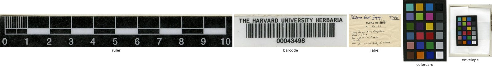

| Model | [`lm3_archival_detector__yolo26x_det_1280`](https://huggingface.co/phyloforfun/lm3_archival_detector__yolo26x_det_1280) (default) · [`yolo26n_det_640`](https://huggingface.co/phyloforfun/lm3_archival_detector__yolo26n_det_640) (lightweight) |
|---|---|
| Architecture | YOLO26x object detection, end-to-end (NMS-free), 1280 px |
| Classes | 9: Ruler, Barcode, Colorcard, Label, Map, Envelope, Photo, Attached Item, Weights |
| Trained on | 8,470 sheets from 67 annotation projects |
| Accuracy | test mAP50 0.949, mAP50-95 0.775 (nano alternate: 0.884 / 0.678) |

### 3. Plant Detector

Places bounding boxes around plant organs: whole leaves, partial leaves, single and grouped
fruits, single and grouped flowers, buds, roots, and wood. Whole-leaf boxes (`Leaf_WHOLE`, the
"ideal leaves" of LeafMachine2) are the input to leaf segmentation and landmarking; every class
is counted by the phenology stage and cropped. As in LeafMachine2, leaflets are treated as simple
leaves.

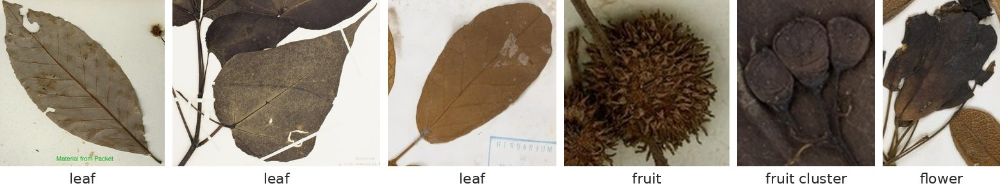

| Model | [`lm3_plant_detector__yolo26x_det_1280`](https://huggingface.co/phyloforfun/lm3_plant_detector__yolo26x_det_1280) (default) · [`yolo26n_det_640`](https://huggingface.co/phyloforfun/lm3_plant_detector__yolo26n_det_640) (lightweight) |
|---|---|
| Architecture | YOLO26x object detection, end-to-end (NMS-free), 1280 px |
| Classes | 9: Leaf_WHOLE, Leaf_PARTIAL, Seed_Fruit_ONE, Seed_Fruit_MANY, Flower_ONE, Flower_MANY, Bud, Roots, Wood |
| Trained on | 22,785 sheets from 83 annotation projects |
| Accuracy | test mAP50 0.382, mAP50-95 0.233 (nano alternate: 0.237 / 0.135) |

The plant data set is far more heterogeneous than the archival one, so its mAP is lower, as it
was for LeafMachine2. What matters in practice is that a leaf the detector misses is never
segmented or landmarked, so the detector is tuned for recall on whole leaves.

### 4. Specimen Segmenter

A whole-sheet plant-versus-background mask, independent of the plant boxes. It removes the paper,
labels, and mounting materials from the sheet to leave only plant material, with an optional
paper-cleanup pass. Used for background removal and for the whole-specimen mask products.

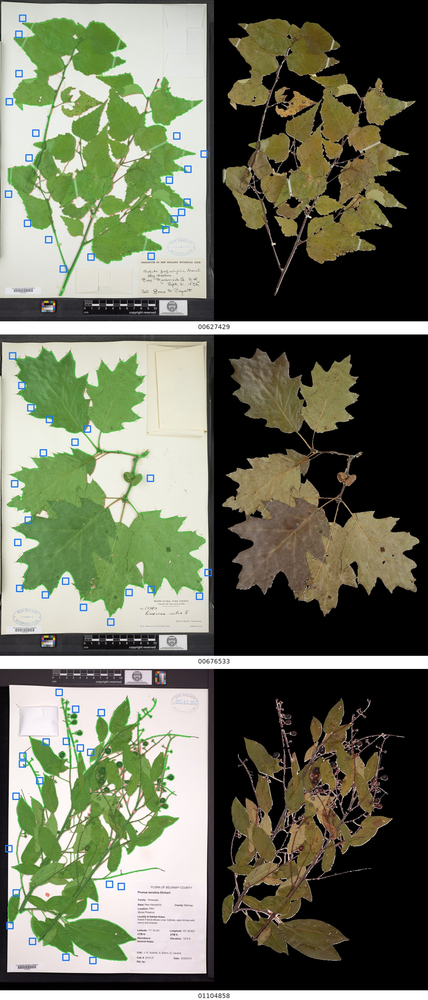

| Model | [`lm3_specimen_segmenter__unetpp_effb7_1024`](https://huggingface.co/phyloforfun/lm3_specimen_segmenter__unetpp_effb7_1024) (default) · [`birefnet_hr_swinl_1024`](https://huggingface.co/phyloforfun/lm3_specimen_segmenter__birefnet_hr_swinl_1024) · [`yolo26x_seg_1280`](https://huggingface.co/phyloforfun/lm3_specimen_segmenter__yolo26x_seg_1280) |
|---|---|
| Architecture | UNet++ with an EfficientNet-B7 encoder, 1024 px; alternates are BiRefNet (Swin-L) and YOLO26x-seg |
| Classes | 1: plant |
| Trained on | 18,904 sheets from 75 annotation projects (machine-generated targets, SAM 3 → self-training) |
| Accuracy | test Dice 0.948 (median 0.977), IoU 0.916 against the machine-generated masks |

BiRefNet scores slightly higher at the median and is markedly slower on CPU; YOLO26x-seg keeps
more of the paper enclosed by stems. Faint, dried-brown material on similarly colored paper is
the known weak case for all three.

### 5. Phenology Detector

Reads the plant detections to decide whether leaves, flowers, and fruits are present on the sheet.
No model: it applies count thresholds to the Plant Detector's boxes. The output file is laid out
like LeafMachine2's `phenology.csv` so existing phenology scripts read it unchanged; the two
LeafMachine2 columns that LeafMachine3 does not produce (`leaflet`, `specimen`) are left blank.

### 6. Ruler Classifier

Assigns a unit type to every ruler crop, the first half of measuring the conversion factor.
Each crop is squarified (rotated to landscape, grayscale, tiled into a four-view collage, as in
LeafMachine2) and classified by a three-model ensemble by majority vote. The per-specimen
consensus goes to the next stage.

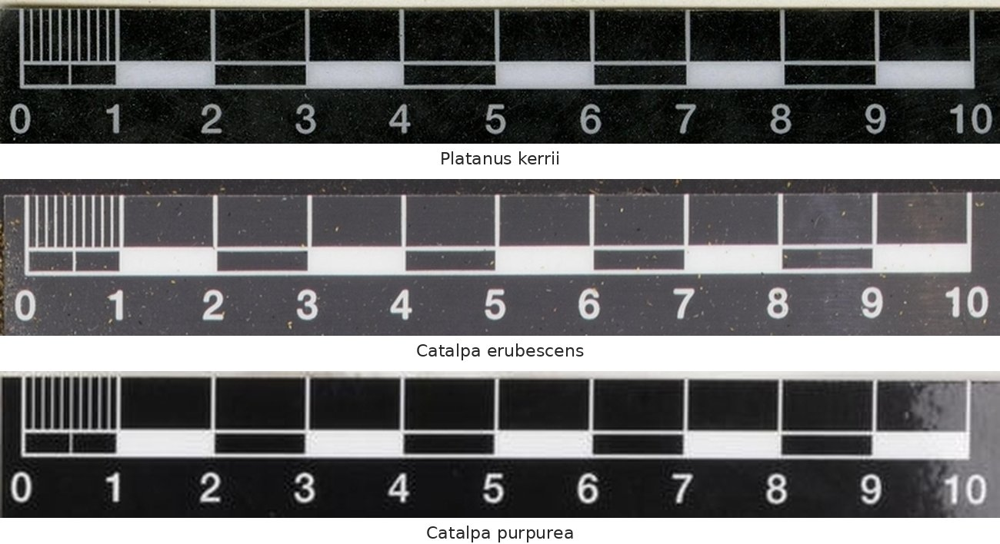

The 18 classes, one squarified four-tile example each (the classifier's actual input):

<table>
  <tr><td align="center">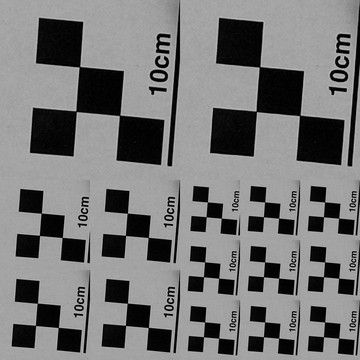<br><sub><code>FP</code></sub></td><td align="center">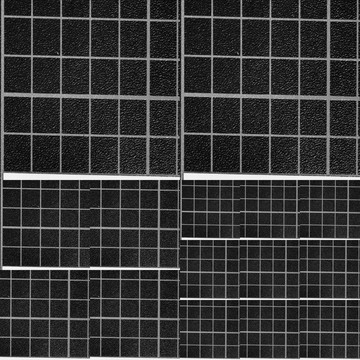<br><sub><code>GRID_CM</code></sub></td><td align="center">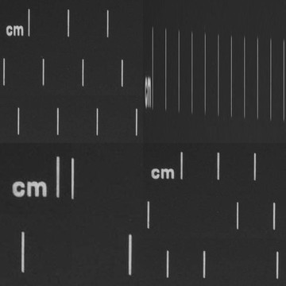<br><sub><code>METRIC_CM</code></sub></td><td align="center">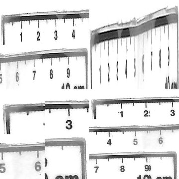<br><sub><code>METRIC_CM2</code></sub></td><td align="center">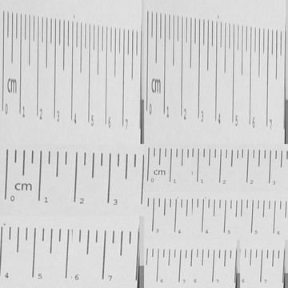<br><sub><code>METRIC_CM4</code></sub></td><td align="center">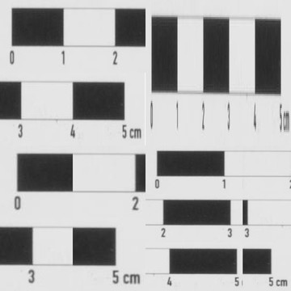<br><sub><code>METRIC_CM_BLOCK</code></sub></td></tr>
  <tr><td align="center">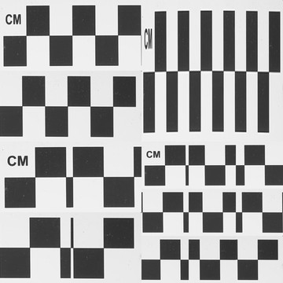<br><sub><code>METRIC_CM_STAGGER</code></sub></td><td align="center">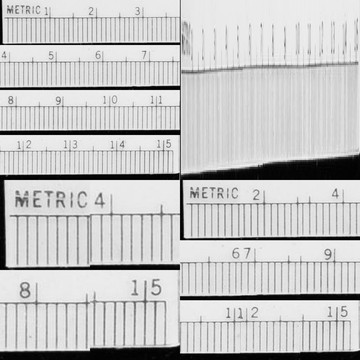<br><sub><code>METRIC_MM</code></sub></td><td align="center">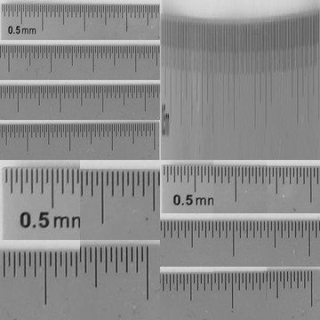<br><sub><code>METRIC_MM2</code></sub></td><td align="center">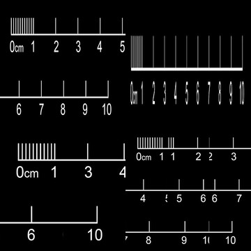<br><sub><code>METRIC_MM_CM</code></sub></td><td align="center">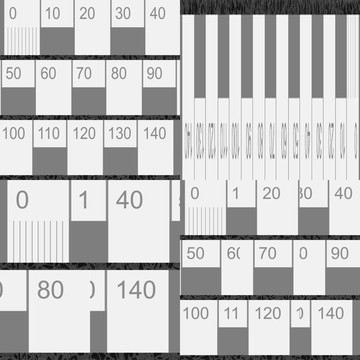<br><sub><code>METRIC_MM_CM_BLOCK</code></sub></td><td align="center">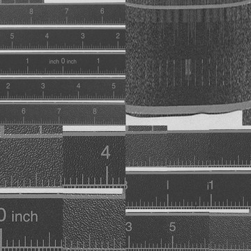<br><sub><code>METRIC_MM_IN16</code></sub></td></tr>
  <tr><td align="center">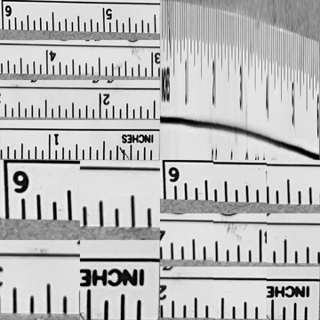<br><sub><code>STD_IN16</code></sub></td><td align="center">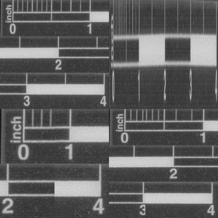<br><sub><code>STD_IN16_IN8_IN2</code></sub></td><td align="center">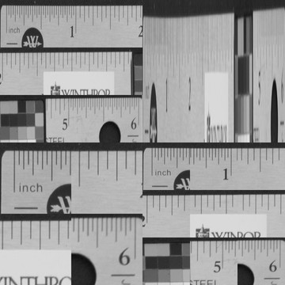<br><sub><code>STD_IN32_IN16</code></sub></td><td align="center">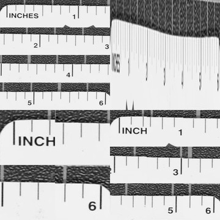<br><sub><code>STD_IN8</code></sub></td><td align="center">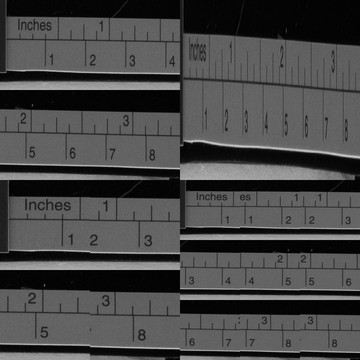<br><sub><code>STD_IN8_CM</code></sub></td><td align="center">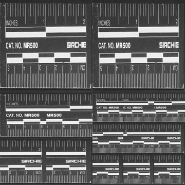<br><sub><code>messy</code></sub></td></tr>
</table>

| Model | ensemble: [`yolo26x_cls_224`](https://huggingface.co/phyloforfun/lm3_ruler_classifier_ensemble__yolo26x_cls_224) + [`yolo26n_cls_224`](https://huggingface.co/phyloforfun/lm3_ruler_classifier_ensemble__yolo26n_cls_224) + [`dinov2_frozen_mlp`](https://huggingface.co/phyloforfun/lm3_ruler_classifier_ensemble__dinov2_frozen_mlp) |
|---|---|
| Architecture | YOLO26x and YOLO26n classifiers, and a frozen DINOv2-base with an MLP head; majority vote, YOLO26x breaks ties |
| Classes | 19 unit types (metric cm / mm / mm-cm, imperial 1/8 – 1/32 in, grid, block, mixed, plus `messy`) |
| Trained on | 13,707 labeled ruler crops |
| Accuracy | test accuracy 0.990 / 0.987 / 0.985 (balanced 0.980 / 0.974 / 0.978) for the three members |

### 7. Ruler Conversion Factor

Measures pixels per centimeter from the ruler's tick lattice. Rather than binarizing the ruler
and scanning for marks, as LeafMachine2 did, it fits a regular lattice to the tick pattern of the
unit type the classifier assigned, so hundreds of tick spacings vote on one factor. The factor is
**published** only when the fit is confident and agrees with the resolution prior from stage 1;
otherwise the sheet is left unconverted rather than mis-converted. The QC panel shows the crop,
the lattice fit, and the verdict. FieldPrism markers (`FP`) are measured from their own geometry
instead; see [FieldPrism sheets](#fieldprism-sheets).

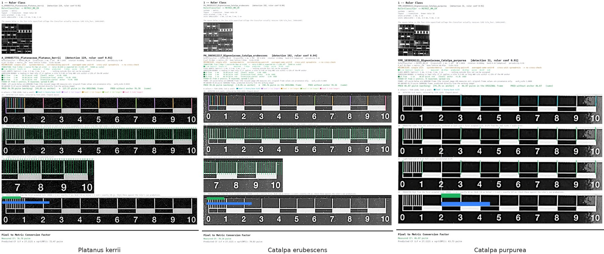

#### When the ruler conversion factor fails

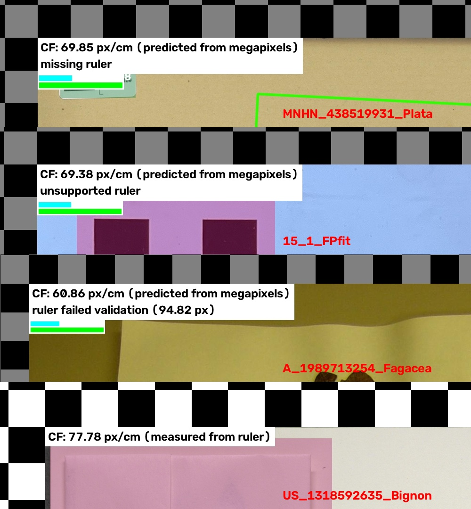

With `modules.ruler_cf.use_CF_predicted_by_MP: true` (off by default), a sheet with no ruler, or
one whose lattice did not pass, gets the stage 1 prediction instead, so it still has cm
measurements. Every output says which kind it is: `specimen.cf_source` and the `cf_source` CSV
column read `measured_from_ruler`, `measured_from_fieldprism` or `predicted_from_megapixels`. The CF banner on the summary
overlay names the source, and a predicted factor gets a second line saying why. Top to bottom:

- **`missing ruler`**: the archival detector found no ruler on the sheet.
- **`unsupported ruler`**: every ruler was a unit type the lattice does not measure yet.
  Rulers that were attempted but could not be read say `unreadable ruler`; a mix of the two
  says `unusable ruler`.
- **`ruler failed validation (94.82 px)`**: the lattice produced a reading, but it was not
  confident or disagreed with the megapixel prior, so it was withheld. The rejected reading is
  shown for audit.
- **`measured from ruler`**: success. The lattice factor passed and is published, with no
  second line.

A predicted factor's 1 cm / 1 inch raft sits in the top-left corner instead of on a ruler, and
the exterior 1 cm checkerboard is black and 50% gray instead of black and white (compare the
first three examples with the last).

### 8. Leaf Segmenter

Turns each whole-leaf crop into instance masks for the lamina, the petiole, and any holes. As in
LeafMachine2, segmentation runs on one leaf crop at a time, so overlapping leaves, mounting tape,
and cluttered backgrounds are handled per leaf and the network only ever sees the leaf it is
asked about. Holes and petioles are attached to their owning leaf.

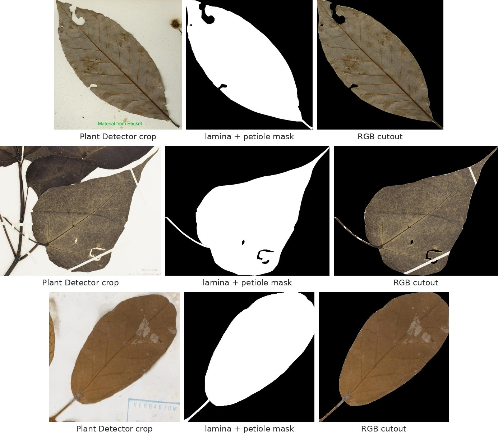

| Model | [`lm3_leaf_segmenter__yolo26x_seg_1024`](https://huggingface.co/phyloforfun/lm3_leaf_segmenter__yolo26x_seg_1024) |
|---|---|
| Architecture | YOLO26x instance segmentation, end-to-end (NMS-free), 1024 px |
| Classes | 3: Leaf, Petiole, Hole |
| Trained on | 16,895 single-leaf crops from 5 annotation projects |
| Accuracy | test mask mAP50 0.726; per class Leaf 0.933, Petiole 0.818, Hole 0.429 |

### 9. Morphology

Shape metrics for every leaf mask, in the LeafMachine2 vocabulary: area, perimeter, centroid,
convex hull, convexity, concavity, circularity, aspect ratio, and the rotated minimum bounding
box whose long and short sides are the leaf's length and width. Areas are hole-aware: lamina
area including holes, excluding holes, total hole area, and hole count are all reported.

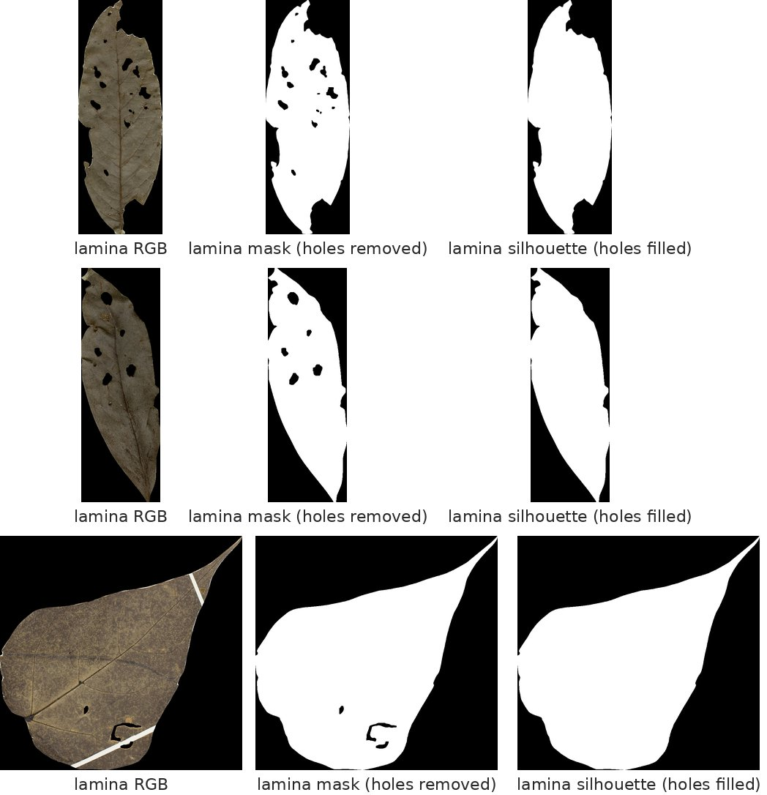

The rotated-box method is selectable (`pca`, the default, `feret`, `lm2`, `minarearect`).

### 10. Landmark Detector

Predicts a 31-keypoint pose skeleton on every whole-leaf crop: the lamina tip and base, apex and
base triples, 15 points tracing the midvein, 6 tracing the petiole, and the two width points.
LeafMachine2 located 9 pseudo-landmarks as fixed-size boxes; the pose formulation returns every
point with a confidence, so missing or occluded points are known to be missing.

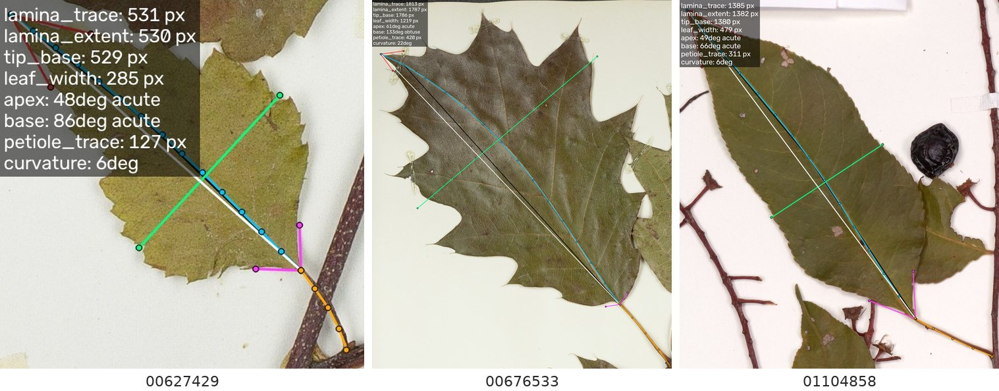

| Model | [`lm3_landmark_detector__yolo26x_pose_640`](https://huggingface.co/phyloforfun/lm3_landmark_detector__yolo26x_pose_640) |
|---|---|
| Architecture | YOLO26x pose, end-to-end (NMS-free), 640 px; the `mid15_pet5` skeleton |
| Keypoints | 31 (lamina_tip, apex ×3, midvein ×15, base ×3, lamina_base, petiole ×6, width ×2) |
| Trained on | 15,217 single-leaf crops, 358,054 keypoint instances, 23 annotation projects |
| Accuracy | test box mAP50 0.995; pose mAP50 0.763, mAP50-95 0.433 (OKS) |

### 11. Landmark Measurements

Derives per-leaf biology from the keypoints: the midvein trace length and its straight-line
extent, the tip-to-base length, the leaf width, apex and base angles with their type (acute,
obtuse, reflex, following LeafMachine2's convention), the petiole trace length, and the lamina
curvature (the largest midvein bend, 0° = straight). It is occlusion-robust: any metric that needs
a low-confidence keypoint is left `NULL`; nothing is fabricated.

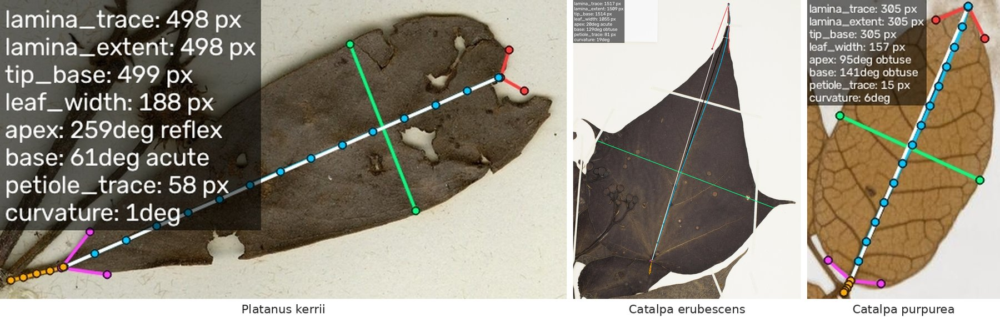

### 12. Leaf Orientation

Computes the rotation that stands each leaf tip-up and base-down, from the lamina tip → base axis
or, failing that, the midvein's principal axis. Every per-leaf product is then written twice: as
mounted (`Leaf_Original/`) and oriented (`Leaf_Oriented/`). Oriented leaves are what the symmetry
and shape stages consume.

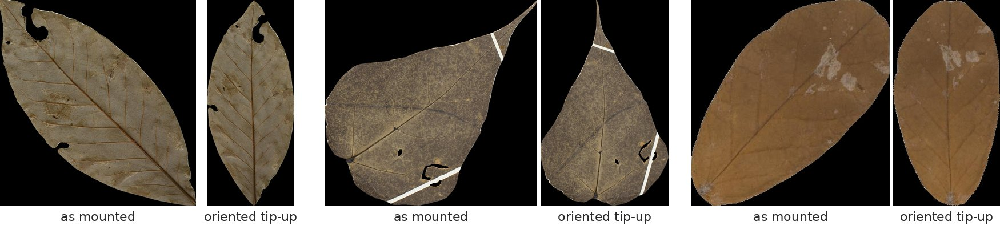

### 13. Petiole Width

Measures each petiole's width as the median of several perpendicular thickness samples near the
blade junction, from the petiole mask and the landmark petiole centerline. The overlay shows the
sample probes and the width band, and blows the petiole up to the pixel so the measurement can be
checked by eye.

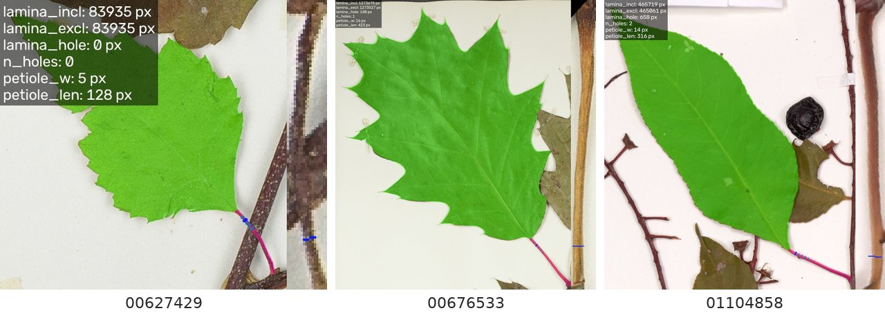

### 14. Bilateral Symmetry

Scores how closely each oriented leaf mirrors itself across its traced midvein, and rolls that up
with mask and trace quality terms into a single **archetype score**: a ranking of which leaves on
a sheet are the cleanest, most representative examples. Gates veto leaves whose masks or traces
are not trustworthy. The Leaf Collage tool uses this ranking to pick leaves.

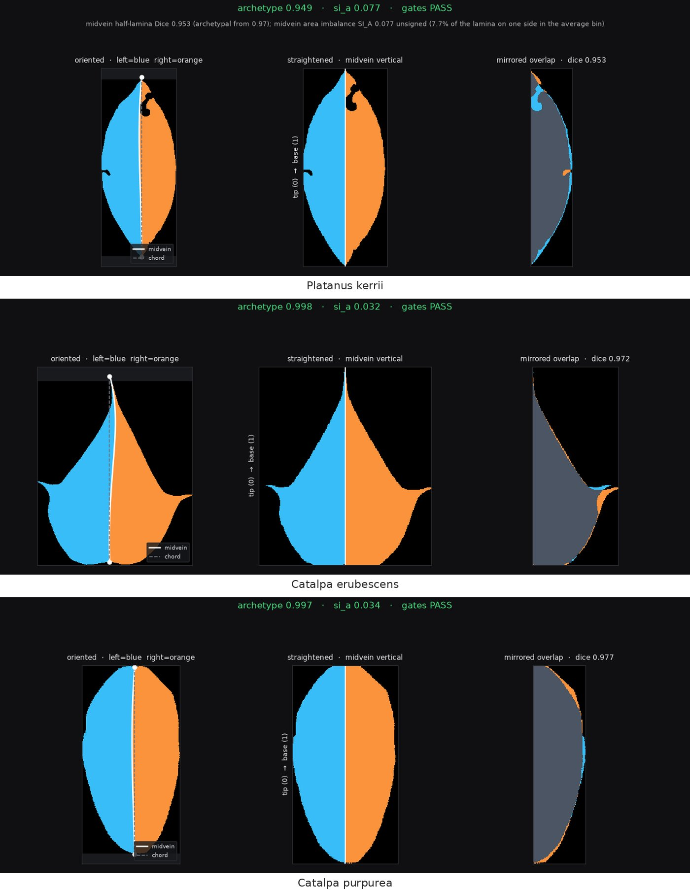

### 15. Metric Grounding

Converts every pixel measurement to real units using the sheet's conversion factor: areas to
cm², lengths to cm. By default that is only a ruler factor the lattice stage published with high
confidence; sheets without one keep their pixel values, and their `_cm` columns are empty rather
than wrong. With `use_CF_predicted_by_MP` on (stage 7), those sheets are grounded with the
resolution estimate instead.

### 16. Reporter

Writes every file LeafMachine3 produces: the summary overlay, the per-leaf overlays, crops,
masks, the seven per-leaf products in both trees, and the CSV export of the database. Every
output folder toggles independently, and the overlay palette (LeafMachine2's by default) is fully
configurable.

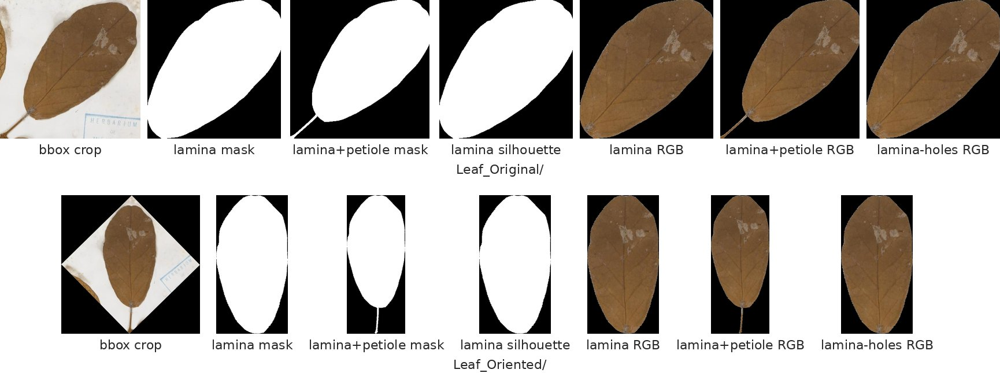

The seven per-leaf products: the detector crop, the lamina mask, the lamina + petiole mask, the
filled lamina silhouette, and RGB cutouts of each (the lamina-holes cutout keeps the tissue and
paints holes a recoverable near-black).

### 17. Shape (ECT)

Computes the Euler Characteristic Transform of every oriented leaf, a topological shape
descriptor that captures the outline from every direction at once and is directly comparable
across leaves and taxa. Three images are written per leaf: the Cartesian ECT, its radial form,
and the radial form with the leaf outline drawn over it, plus the raw coordinates as HDF5.

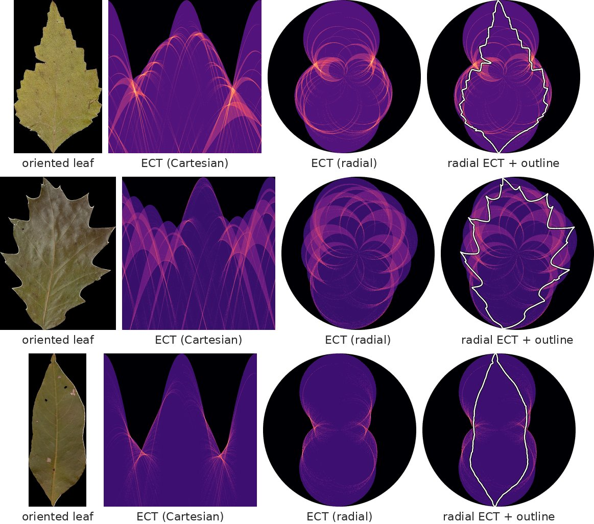

The transform is computed with the [`ect`](https://github.com/MunchLab/ect) Python package
([documentation](https://munchlab.github.io/ect/)). If you use the ECT outputs, please cite:

> Ayub, Y., McGuire-Scullen, S., Percival, S., Weaver, W. N., … Munch, E., & Chitwood, D. H.
> (2026). The Euler Characteristic Transform enables classification of complex plant shapes and
> prediction of leaf venation from blade geometry. *bioRxiv*.
> <https://doi.org/10.64898/2026.04.13.718293>

> Ayub, Y., Munch, E., McGuire Scullen, S., & Chitwood, D. H. (2026). ect: A Python package for
> the Euler Characteristic Transform. *Journal of Open Source Software*, 11(120), 9691.
> <https://doi.org/10.21105/joss.09691>

> Munch, E. (2025). An invitation to the Euler Characteristic Transform. *The American
> Mathematical Monthly*, 132(1), 15–25. <https://doi.org/10.1080/00029890.2024.2409616>

#### ECT options

`modules.ect.num_dirs` (default 360) sets the ECT's resolution. It is both the number of
directions and the number of thresholds, so the matrix and every ECT image are `num_dirs` x
`num_dirs` px. Each row below is the same leaf at one setting (CMRmap palette, log color):

- **180**: a direction every other degree.
- **360** (default): one direction per degree. A good tradeoff: cheap to compute, a convenient
  input size for downstream models such as CNN classifiers, and fine enough to resolve small
  margin features like teeth.
- **720**: two directions per degree.

<table>
  <tr><th>oriented leaf</th><th>ECT (Cartesian)</th><th>radial ECT + outline</th></tr>
  <tr><td align="center">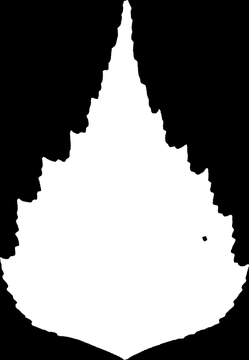<br><sub><b>180</b></sub></td><td align="center">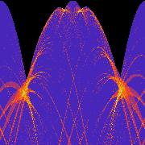</td><td align="center">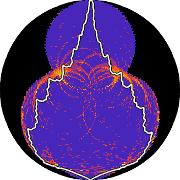</td></tr>
  <tr><td align="center"><br><sub><b>360 (default)</b></sub></td><td align="center">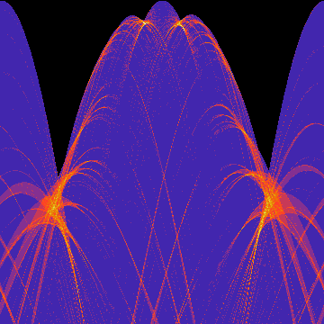</td><td align="center">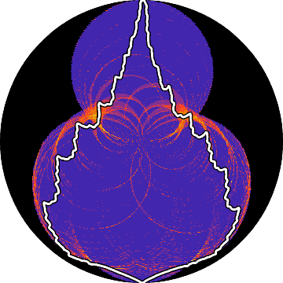</td></tr>
  <tr><td align="center"><br><sub><b>720</b></sub></td><td align="center">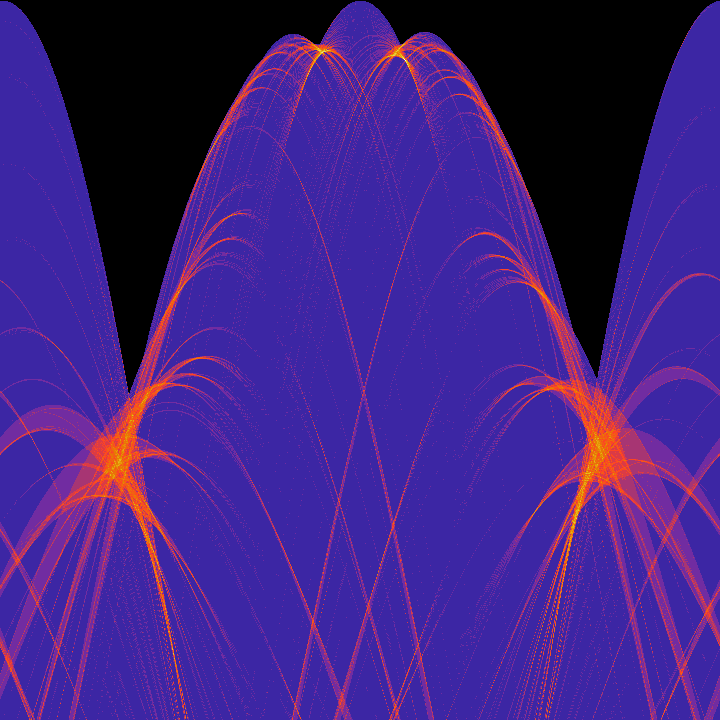</td><td align="center">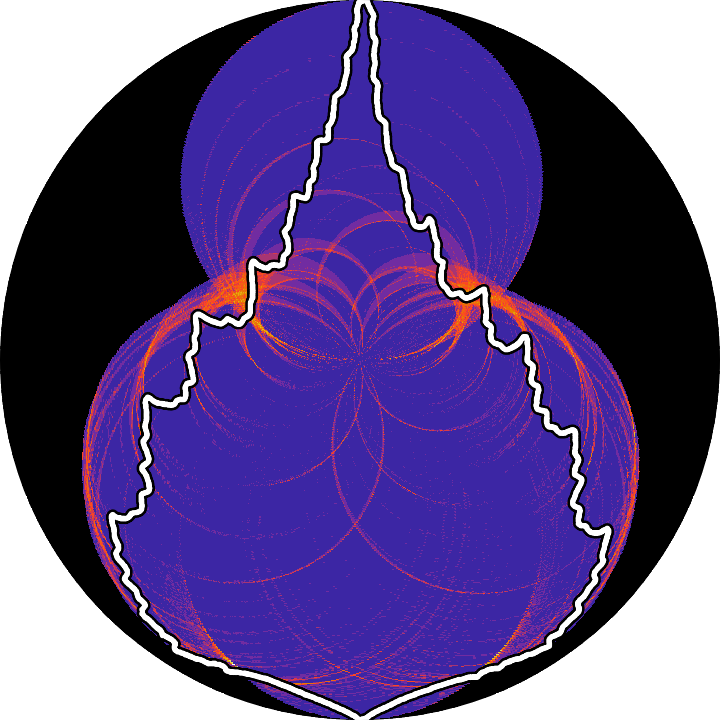</td></tr>
</table>

| `num_dirs` | Image size | `compute_ect` | 3 renders | Total per leaf |
|---|---|---|---|---|
| 180 | 180 x 180 px | 0.061 s | 0.054 s | 0.115 s |
| 360 | 360 x 360 px | 0.062 s | 0.134 s | 0.196 s |
| 720 | 720 x 720 px | 0.074 s | 0.444 s | 0.518 s |

Mean of 10 runs on each of the 5 sample leaves, one CPU process. Rendering, not the transform,
is what grows with resolution. Reproduce with
[`examples/ECT_resolution_options/ect_resolution_comparison.py`](examples/ECT_resolution_options/ect_resolution_comparison.py),
which writes all five leaves to that folder.

#### ECT color options

`modules.ect.palette` takes any Matplotlib colormap name. The first 24 are the ones audited for
the ECT, followed by the other 60 built-in colormaps, all on the same leaf's 360 Cartesian ECT.
Each pair shows the plain color scale on the left and `apply_log_to_visual_for_bold_color: true`
on the right. The log is a signed `log1p` applied only
to the image, so it spreads the dense mid-range across the colormap without changing the stored
ECT. Every palette and view for all five sample leaves is in
[`examples/ECT_color_options/`](examples/ECT_color_options/).

<table>
  <tr><th colspan="2"><code>CMRmap</code></th><th colspan="2"><code>magma</code></th><th colspan="2"><code>inferno</code></th></tr>
  <tr><td align="center">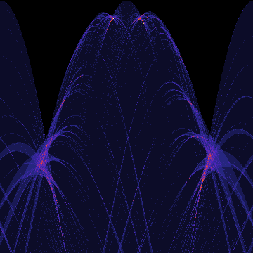<br><sub>linear</sub></td><td align="center"><br><sub><b>log (default)</b></sub></td><td align="center">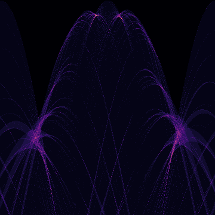<br><sub>linear</sub></td><td align="center">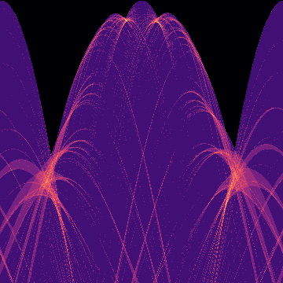<br><sub>log</sub></td><td align="center">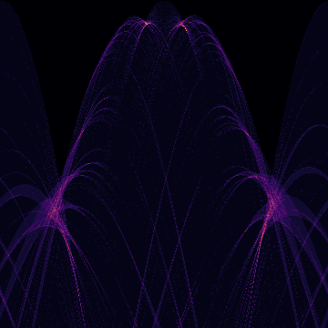<br><sub>linear</sub></td><td align="center">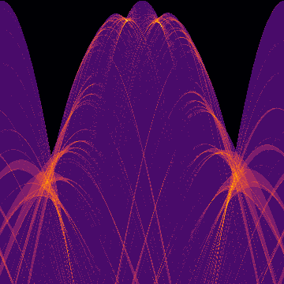<br><sub>log</sub></td></tr>
  <tr><th colspan="2"><code>bone</code></th><th colspan="2"><code>gray</code></th><th colspan="2"><code>pink</code></th></tr>
  <tr><td align="center">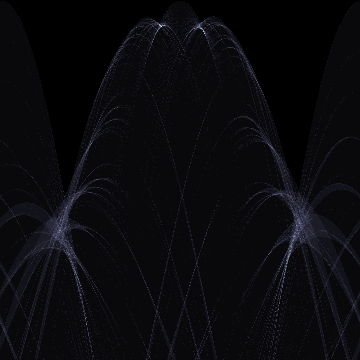<br><sub>linear</sub></td><td align="center">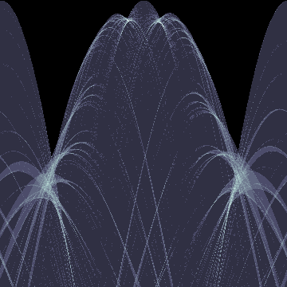<br><sub>log</sub></td><td align="center">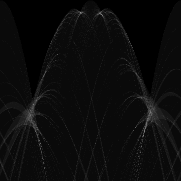<br><sub>linear</sub></td><td align="center">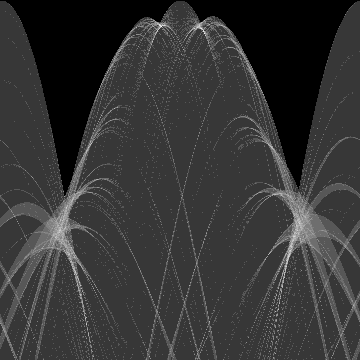<br><sub>log</sub></td><td align="center">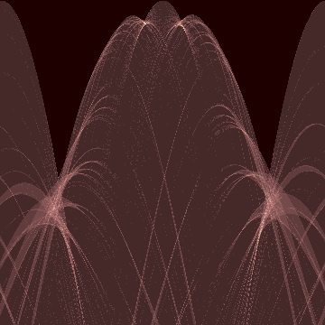<br><sub>linear</sub></td><td align="center">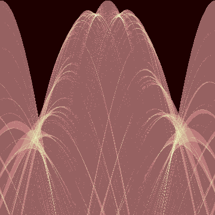<br><sub>log</sub></td></tr>
  <tr><th colspan="2"><code>viridis</code></th><th colspan="2"><code>cividis</code></th><th colspan="2"><code>winter</code></th></tr>
  <tr><td align="center">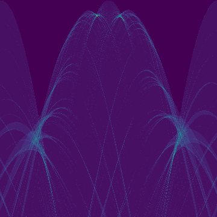<br><sub>linear</sub></td><td align="center">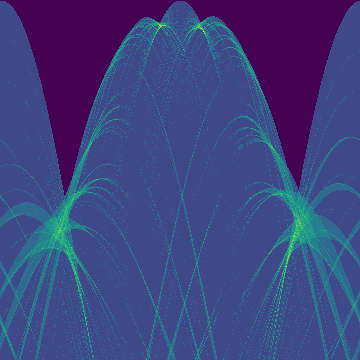<br><sub>log</sub></td><td align="center">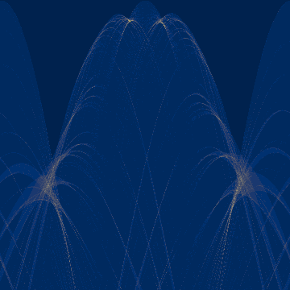<br><sub>linear</sub></td><td align="center">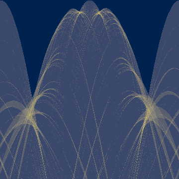<br><sub>log</sub></td><td align="center">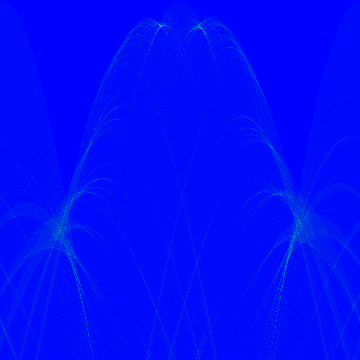<br><sub>linear</sub></td><td align="center">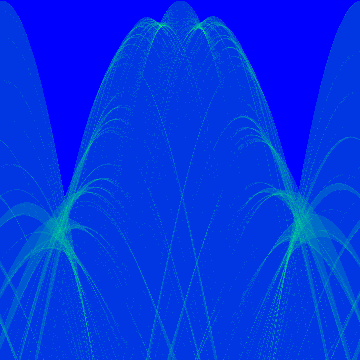<br><sub>log</sub></td></tr>
  <tr><th colspan="2"><code>cool</code></th><th colspan="2"><code>summer</code></th><th colspan="2"><code>spring</code></th></tr>
  <tr><td align="center">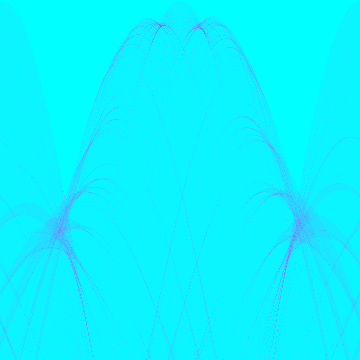<br><sub>linear</sub></td><td align="center">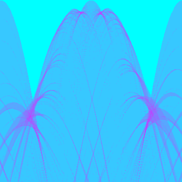<br><sub>log</sub></td><td align="center">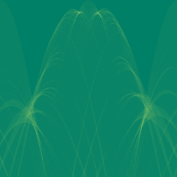<br><sub>linear</sub></td><td align="center">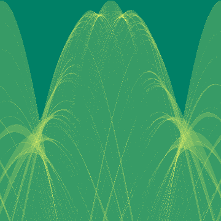<br><sub>log</sub></td><td align="center">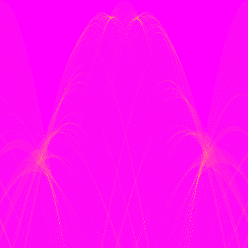<br><sub>linear</sub></td><td align="center">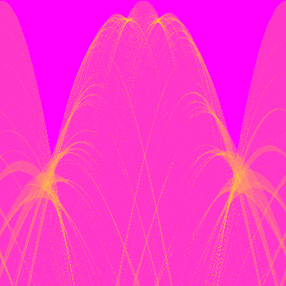<br><sub>log</sub></td></tr>
  <tr><th colspan="2"><code>YlGn</code></th><th colspan="2"><code>Blues</code></th><th colspan="2"><code>Greens</code></th></tr>
  <tr><td align="center">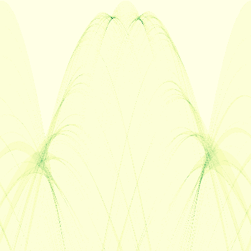<br><sub>linear</sub></td><td align="center">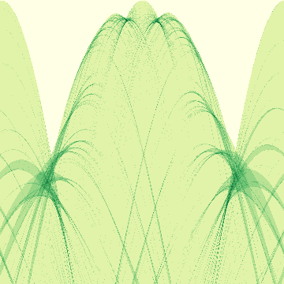<br><sub>log</sub></td><td align="center">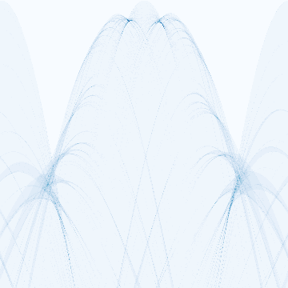<br><sub>linear</sub></td><td align="center">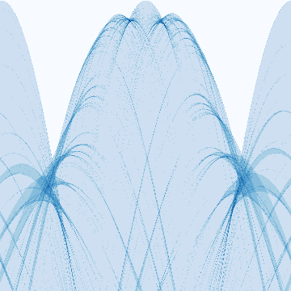<br><sub>log</sub></td><td align="center">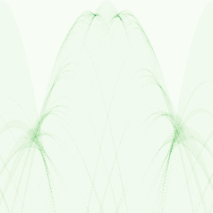<br><sub>linear</sub></td><td align="center">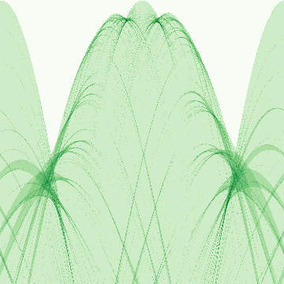<br><sub>log</sub></td></tr>
  <tr><th colspan="2"><code>Purples</code></th><th colspan="2"><code>Greys</code></th><th colspan="2"><code>Oranges</code></th></tr>
  <tr><td align="center">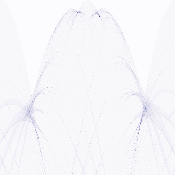<br><sub>linear</sub></td><td align="center">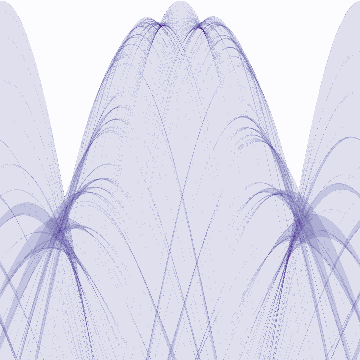<br><sub>log</sub></td><td align="center">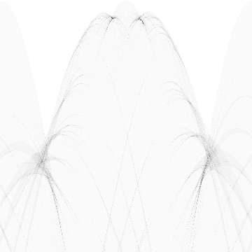<br><sub>linear</sub></td><td align="center">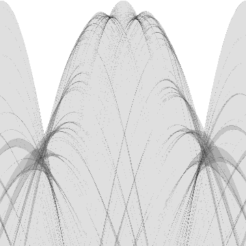<br><sub>log</sub></td><td align="center">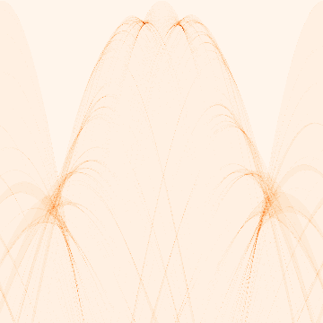<br><sub>linear</sub></td><td align="center">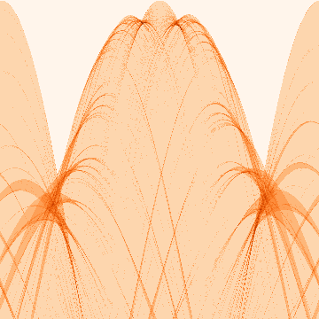<br><sub>log</sub></td></tr>
  <tr><th colspan="2"><code>Reds</code></th><th colspan="2"><code>cubehelix</code></th><th colspan="2"><code>plasma</code></th></tr>
  <tr><td align="center">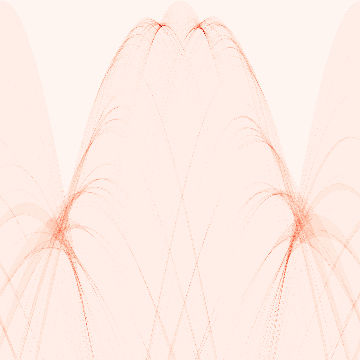<br><sub>linear</sub></td><td align="center">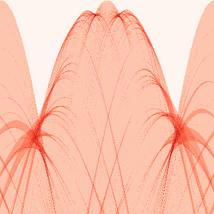<br><sub>log</sub></td><td align="center">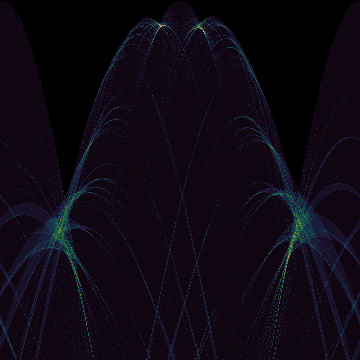<br><sub>linear</sub></td><td align="center">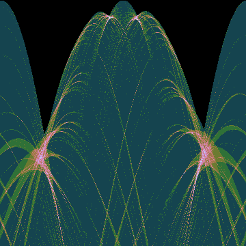<br><sub>log</sub></td><td align="center">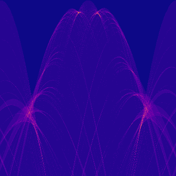<br><sub>linear</sub></td><td align="center">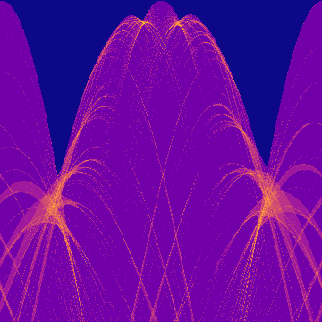<br><sub>log</sub></td></tr>
  <tr><th colspan="2"><code>nipy_spectral</code></th><th colspan="2"><code>afmhot</code></th><th colspan="2"><code>YlOrBr</code></th></tr>
  <tr><td align="center">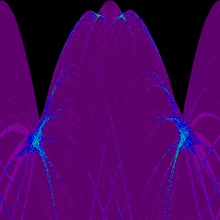<br><sub>linear</sub></td><td align="center">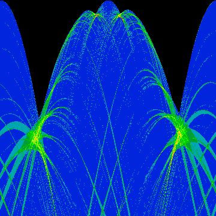<br><sub>log</sub></td><td align="center">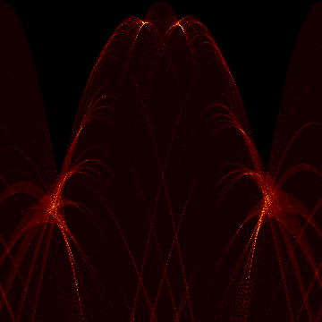<br><sub>linear</sub></td><td align="center">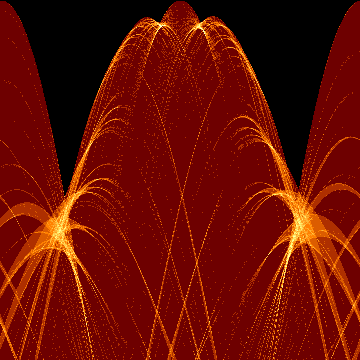<br><sub>log</sub></td><td align="center">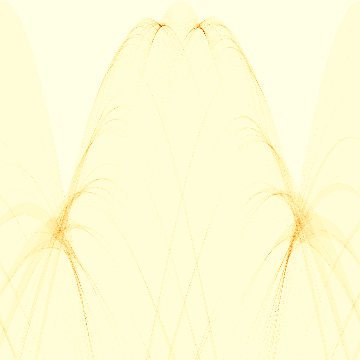<br><sub>linear</sub></td><td align="center">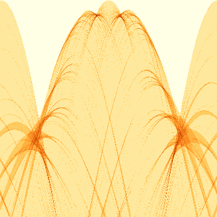<br><sub>log</sub></td></tr>
  <tr><td colspan="6" align="center"><b>Palettes below are not recommended, but it's your choice!</b></td></tr>
  <tr><th colspan="2"><code>YlOrRd</code></th><th colspan="2"><code>OrRd</code></th><th colspan="2"><code>PuRd</code></th></tr>
  <tr><td align="center">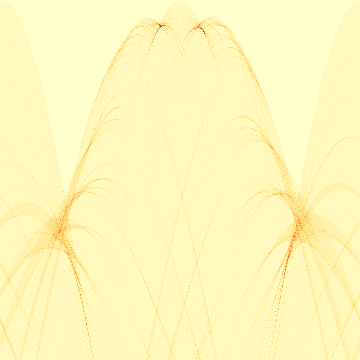<br><sub>linear</sub></td><td align="center">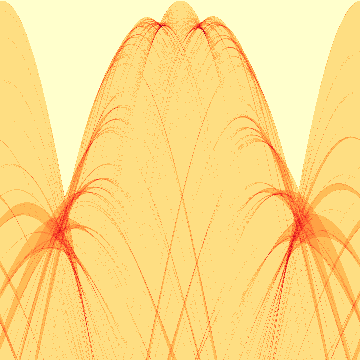<br><sub>log</sub></td><td align="center">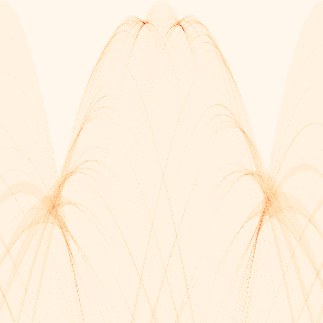<br><sub>linear</sub></td><td align="center">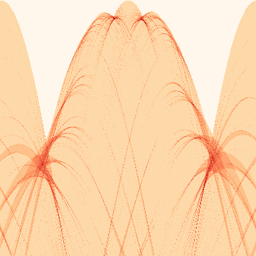<br><sub>log</sub></td><td align="center">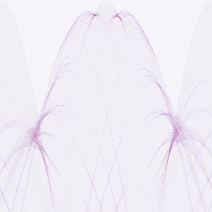<br><sub>linear</sub></td><td align="center">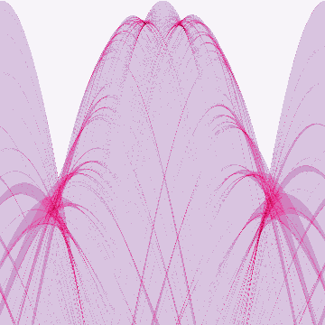<br><sub>log</sub></td></tr>
  <tr><th colspan="2"><code>RdPu</code></th><th colspan="2"><code>BuPu</code></th><th colspan="2"><code>GnBu</code></th></tr>
  <tr><td align="center">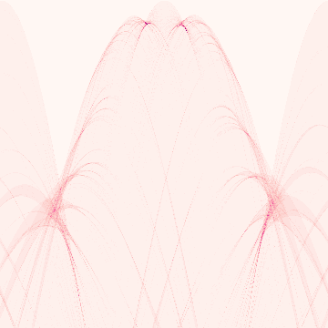<br><sub>linear</sub></td><td align="center">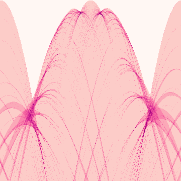<br><sub>log</sub></td><td align="center">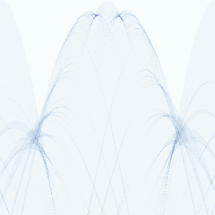<br><sub>linear</sub></td><td align="center">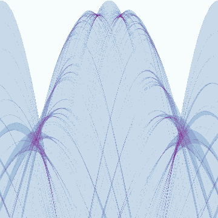<br><sub>log</sub></td><td align="center">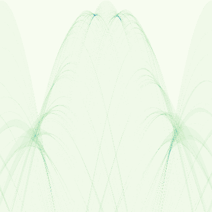<br><sub>linear</sub></td><td align="center">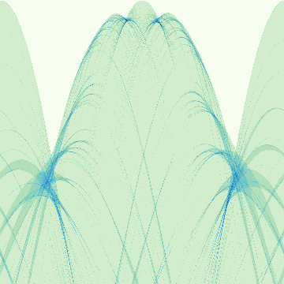<br><sub>log</sub></td></tr>
  <tr><th colspan="2"><code>PuBu</code></th><th colspan="2"><code>YlGnBu</code></th><th colspan="2"><code>PuBuGn</code></th></tr>
  <tr><td align="center">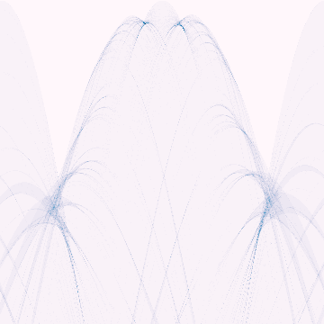<br><sub>linear</sub></td><td align="center">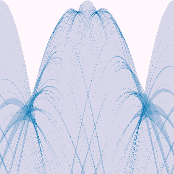<br><sub>log</sub></td><td align="center">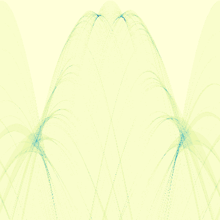<br><sub>linear</sub></td><td align="center">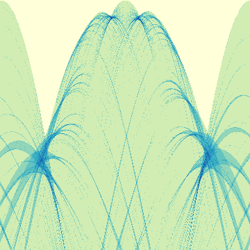<br><sub>log</sub></td><td align="center">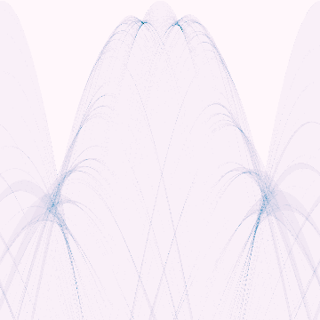<br><sub>linear</sub></td><td align="center">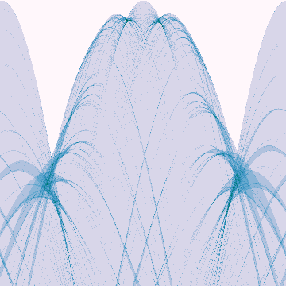<br><sub>log</sub></td></tr>
  <tr><th colspan="2"><code>BuGn</code></th><th colspan="2"><code>autumn</code></th><th colspan="2"><code>Wistia</code></th></tr>
  <tr><td align="center">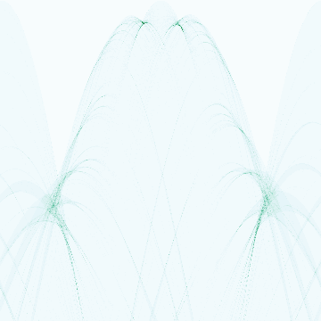<br><sub>linear</sub></td><td align="center">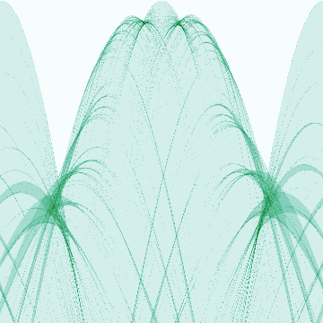<br><sub>log</sub></td><td align="center">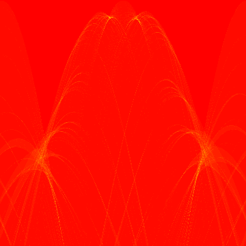<br><sub>linear</sub></td><td align="center">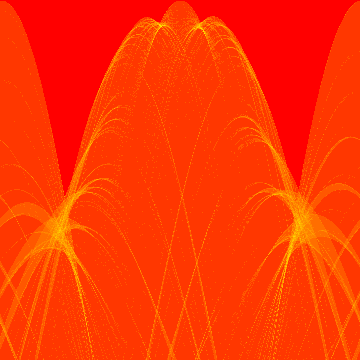<br><sub>log</sub></td><td align="center">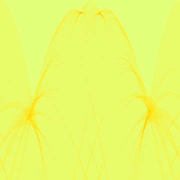<br><sub>linear</sub></td><td align="center">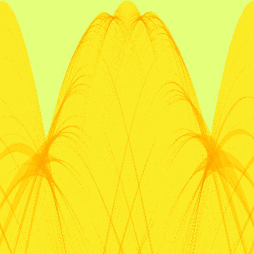<br><sub>log</sub></td></tr>
  <tr><th colspan="2"><code>hot</code></th><th colspan="2"><code>gist_heat</code></th><th colspan="2"><code>copper</code></th></tr>
  <tr><td align="center">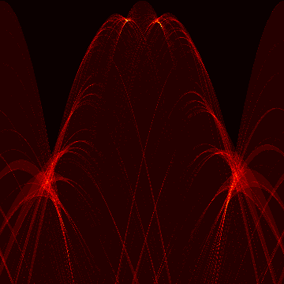<br><sub>linear</sub></td><td align="center">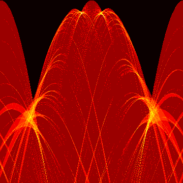<br><sub>log</sub></td><td align="center">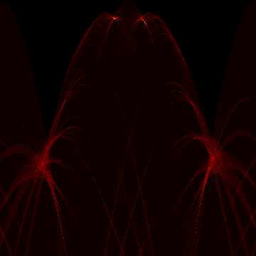<br><sub>linear</sub></td><td align="center">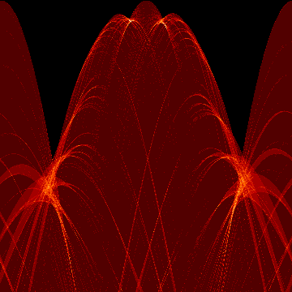<br><sub>log</sub></td><td align="center">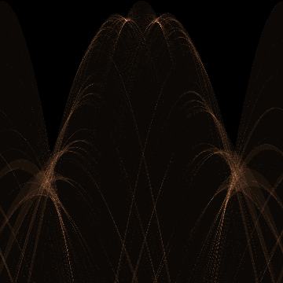<br><sub>linear</sub></td><td align="center">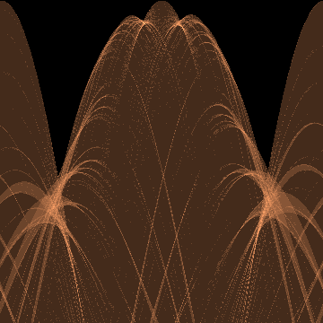<br><sub>log</sub></td></tr>
  <tr><th colspan="2"><code>PiYG</code></th><th colspan="2"><code>PRGn</code></th><th colspan="2"><code>BrBG</code></th></tr>
  <tr><td align="center">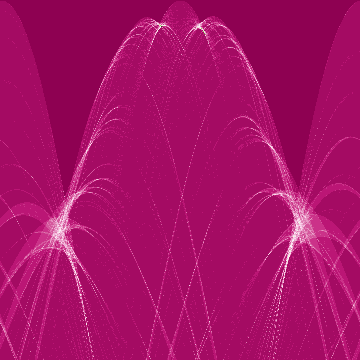<br><sub>linear</sub></td><td align="center">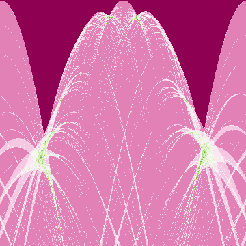<br><sub>log</sub></td><td align="center">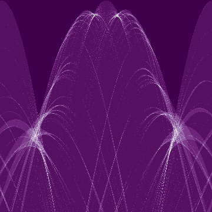<br><sub>linear</sub></td><td align="center">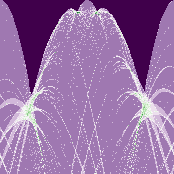<br><sub>log</sub></td><td align="center">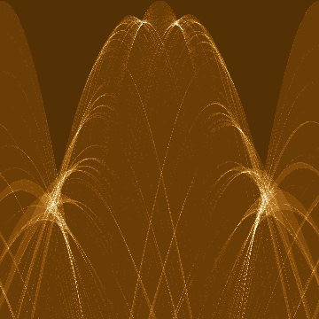<br><sub>linear</sub></td><td align="center">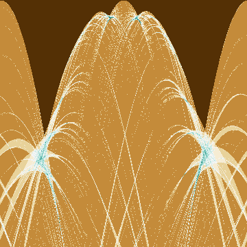<br><sub>log</sub></td></tr>
  <tr><th colspan="2"><code>PuOr</code></th><th colspan="2"><code>RdGy</code></th><th colspan="2"><code>RdBu</code></th></tr>
  <tr><td align="center">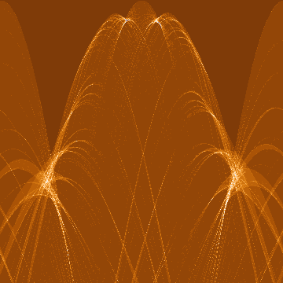<br><sub>linear</sub></td><td align="center">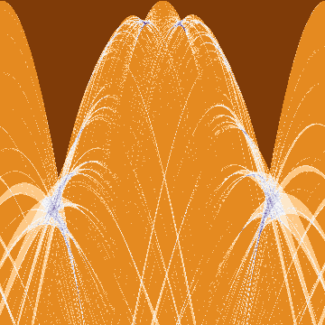<br><sub>log</sub></td><td align="center"><br><sub>linear</sub></td><td align="center">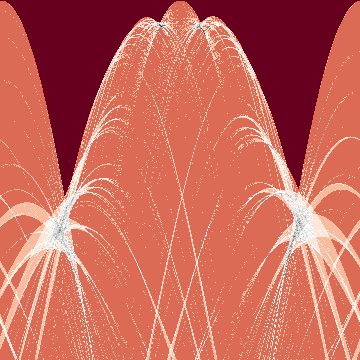<br><sub>log</sub></td><td align="center">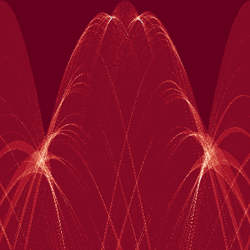<br><sub>linear</sub></td><td align="center">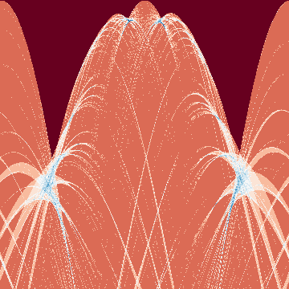<br><sub>log</sub></td></tr>
  <tr><th colspan="2"><code>RdYlBu</code></th><th colspan="2"><code>RdYlGn</code></th><th colspan="2"><code>Spectral</code></th></tr>
  <tr><td align="center">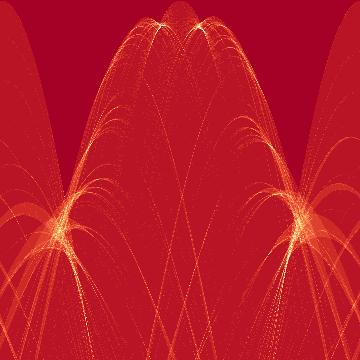<br><sub>linear</sub></td><td align="center">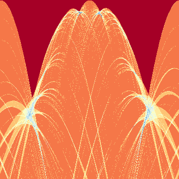<br><sub>log</sub></td><td align="center"><br><sub>linear</sub></td><td align="center">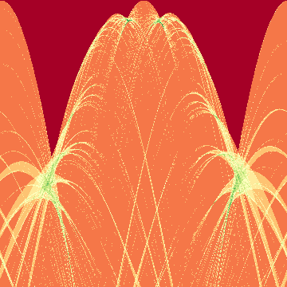<br><sub>log</sub></td><td align="center">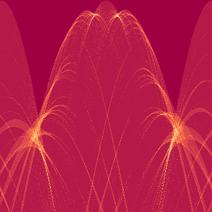<br><sub>linear</sub></td><td align="center"><br><sub>log</sub></td></tr>
  <tr><th colspan="2"><code>coolwarm</code></th><th colspan="2"><code>bwr</code></th><th colspan="2"><code>seismic</code></th></tr>
  <tr><td align="center">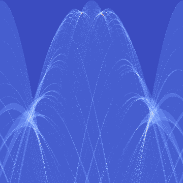<br><sub>linear</sub></td><td align="center">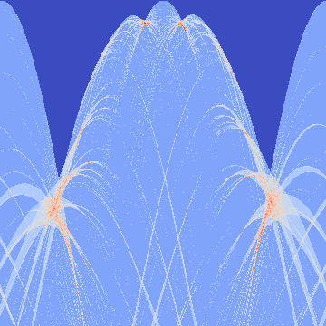<br><sub>log</sub></td><td align="center">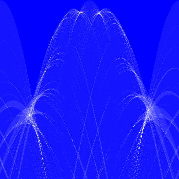<br><sub>linear</sub></td><td align="center">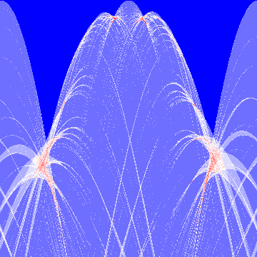<br><sub>log</sub></td><td align="center">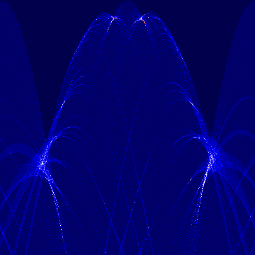<br><sub>linear</sub></td><td align="center">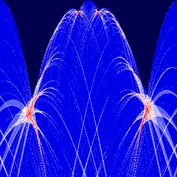<br><sub>log</sub></td></tr>
  <tr><th colspan="2"><code>berlin</code></th><th colspan="2"><code>managua</code></th><th colspan="2"><code>vanimo</code></th></tr>
  <tr><td align="center">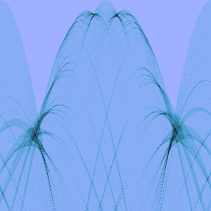<br><sub>linear</sub></td><td align="center">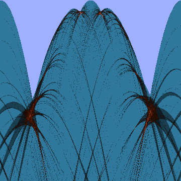<br><sub>log</sub></td><td align="center">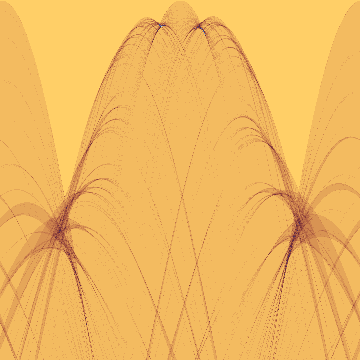<br><sub>linear</sub></td><td align="center">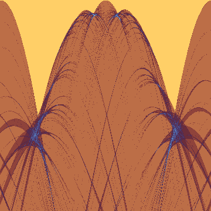<br><sub>log</sub></td><td align="center">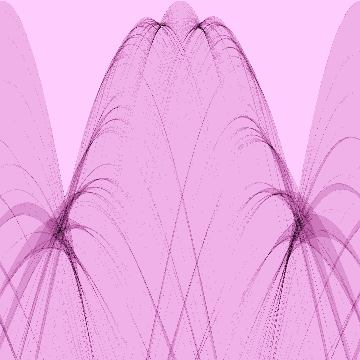<br><sub>linear</sub></td><td align="center">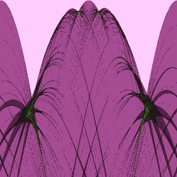<br><sub>log</sub></td></tr>
  <tr><th colspan="2"><code>twilight</code></th><th colspan="2"><code>twilight_shifted</code></th><th colspan="2"><code>hsv</code></th></tr>
  <tr><td align="center">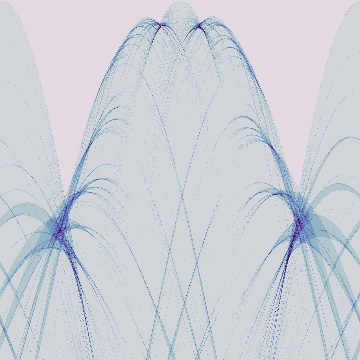<br><sub>linear</sub></td><td align="center">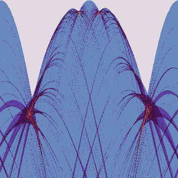<br><sub>log</sub></td><td align="center">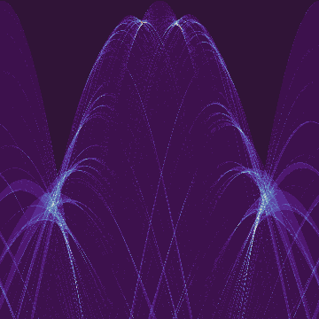<br><sub>linear</sub></td><td align="center">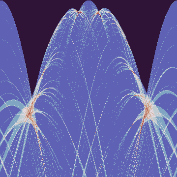<br><sub>log</sub></td><td align="center">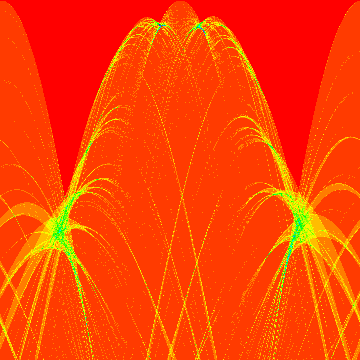<br><sub>linear</sub></td><td align="center">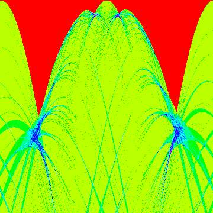<br><sub>log</sub></td></tr>
  <tr><th colspan="2"><code>Pastel1</code></th><th colspan="2"><code>Pastel2</code></th><th colspan="2"><code>Paired</code></th></tr>
  <tr><td align="center">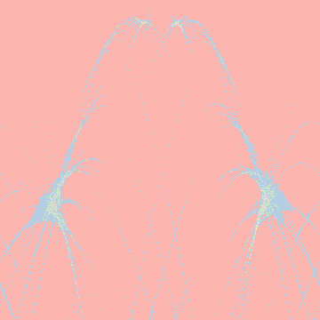<br><sub>linear</sub></td><td align="center">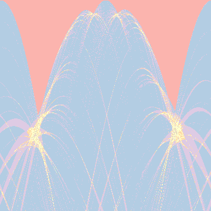<br><sub>log</sub></td><td align="center">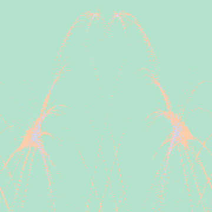<br><sub>linear</sub></td><td align="center">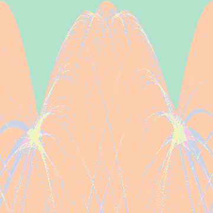<br><sub>log</sub></td><td align="center">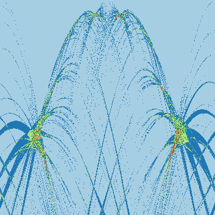<br><sub>linear</sub></td><td align="center">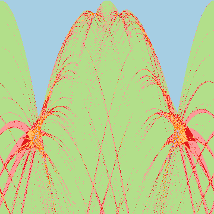<br><sub>log</sub></td></tr>
  <tr><th colspan="2"><code>Accent</code></th><th colspan="2"><code>okabe_ito</code></th><th colspan="2"><code>Dark2</code></th></tr>
  <tr><td align="center">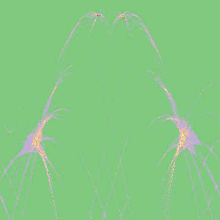<br><sub>linear</sub></td><td align="center">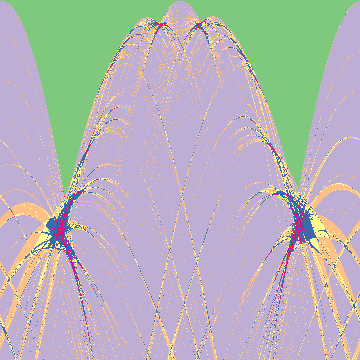<br><sub>log</sub></td><td align="center">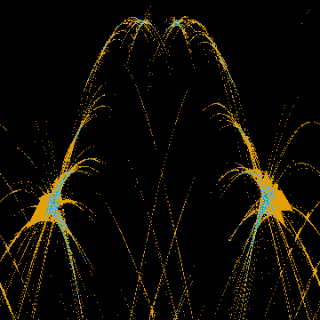<br><sub>linear</sub></td><td align="center">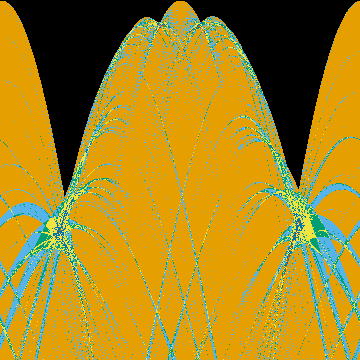<br><sub>log</sub></td><td align="center">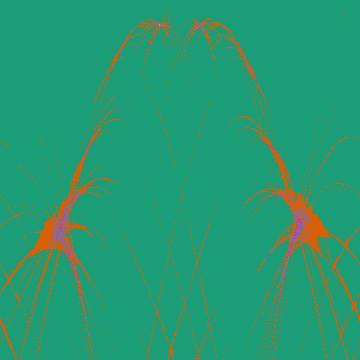<br><sub>linear</sub></td><td align="center">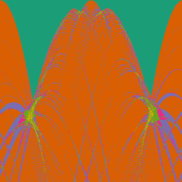<br><sub>log</sub></td></tr>
  <tr><th colspan="2"><code>Set1</code></th><th colspan="2"><code>Set2</code></th><th colspan="2"><code>Set3</code></th></tr>
  <tr><td align="center">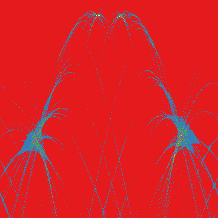<br><sub>linear</sub></td><td align="center">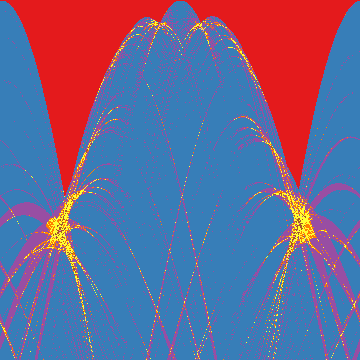<br><sub>log</sub></td><td align="center">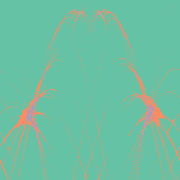<br><sub>linear</sub></td><td align="center">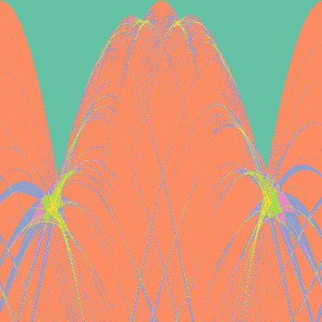<br><sub>log</sub></td><td align="center">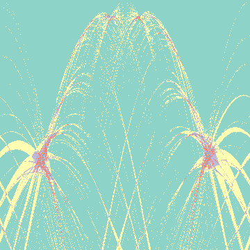<br><sub>linear</sub></td><td align="center">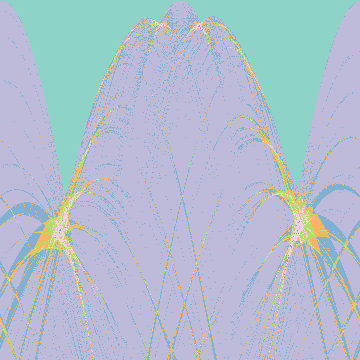<br><sub>log</sub></td></tr>
  <tr><th colspan="2"><code>tab10</code></th><th colspan="2"><code>tab20</code></th><th colspan="2"><code>tab20b</code></th></tr>
  <tr><td align="center">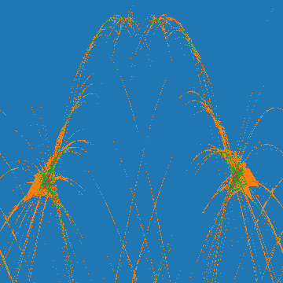<br><sub>linear</sub></td><td align="center">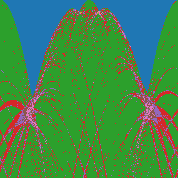<br><sub>log</sub></td><td align="center">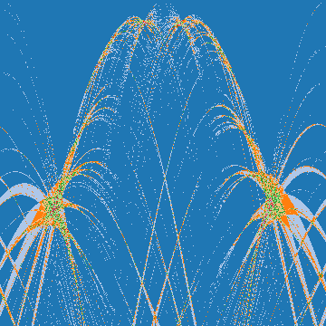<br><sub>linear</sub></td><td align="center">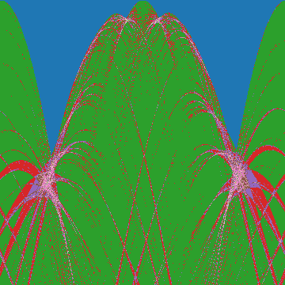<br><sub>log</sub></td><td align="center">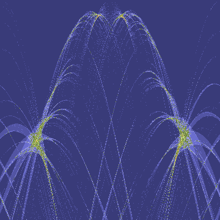<br><sub>linear</sub></td><td align="center">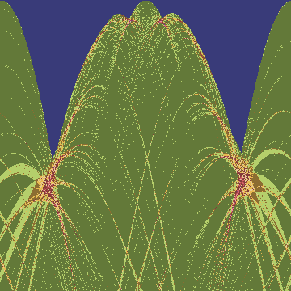<br><sub>log</sub></td></tr>
  <tr><th colspan="2"><code>tab20c</code></th><th colspan="2"><code>flag</code></th><th colspan="2"><code>prism</code></th></tr>
  <tr><td align="center">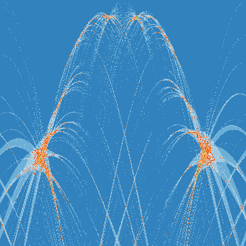<br><sub>linear</sub></td><td align="center">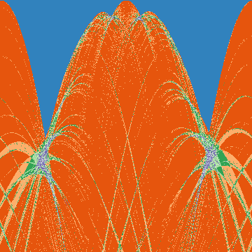<br><sub>log</sub></td><td align="center">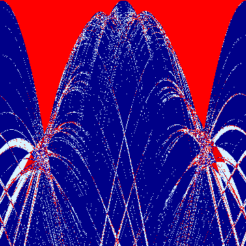<br><sub>linear</sub></td><td align="center">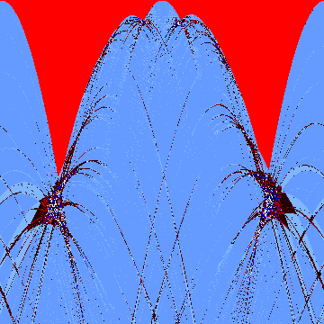<br><sub>log</sub></td><td align="center">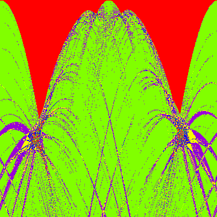<br><sub>linear</sub></td><td align="center">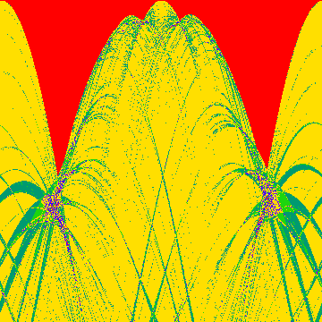<br><sub>log</sub></td></tr>
  <tr><th colspan="2"><code>ocean</code></th><th colspan="2"><code>gist_earth</code></th><th colspan="2"><code>terrain</code></th></tr>
  <tr><td align="center">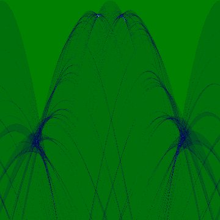<br><sub>linear</sub></td><td align="center">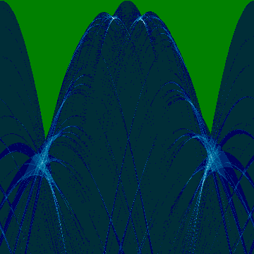<br><sub>log</sub></td><td align="center">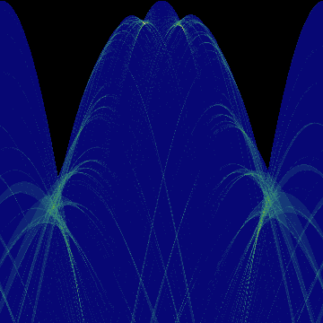<br><sub>linear</sub></td><td align="center">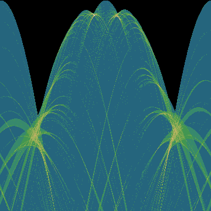<br><sub>log</sub></td><td align="center">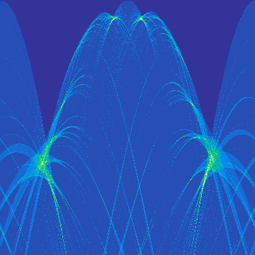<br><sub>linear</sub></td><td align="center">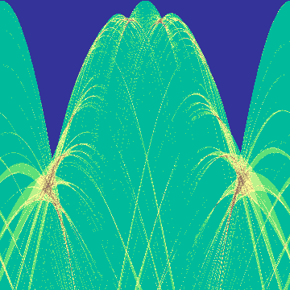<br><sub>log</sub></td></tr>
  <tr><th colspan="2"><code>gist_stern</code></th><th colspan="2"><code>gnuplot</code></th><th colspan="2"><code>gnuplot2</code></th></tr>
  <tr><td align="center">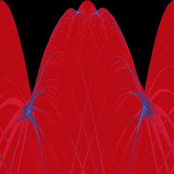<br><sub>linear</sub></td><td align="center">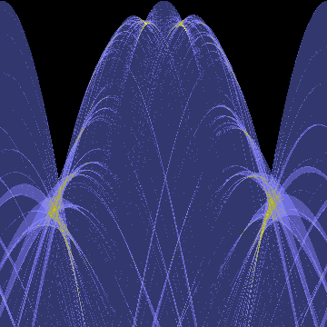<br><sub>log</sub></td><td align="center">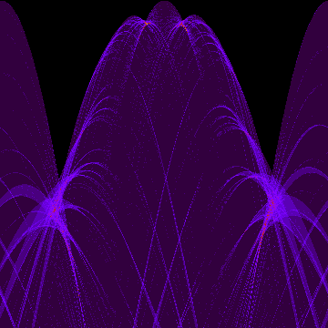<br><sub>linear</sub></td><td align="center">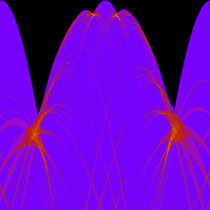<br><sub>log</sub></td><td align="center">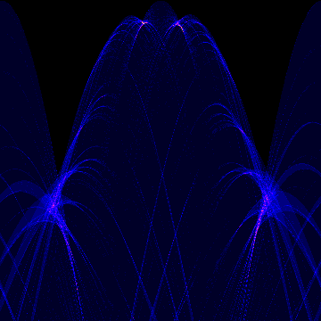<br><sub>linear</sub></td><td align="center">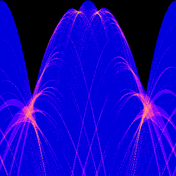<br><sub>log</sub></td></tr>
  <tr><th colspan="2"><code>brg</code></th><th colspan="2"><code>gist_rainbow</code></th><th colspan="2"><code>rainbow</code></th></tr>
  <tr><td align="center">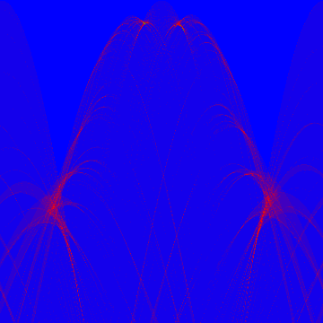<br><sub>linear</sub></td><td align="center">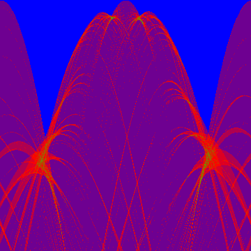<br><sub>log</sub></td><td align="center">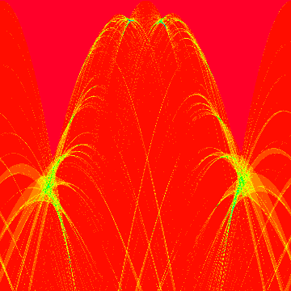<br><sub>linear</sub></td><td align="center">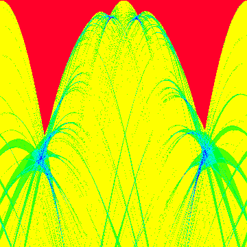<br><sub>log</sub></td><td align="center">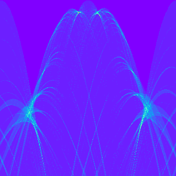<br><sub>linear</sub></td><td align="center">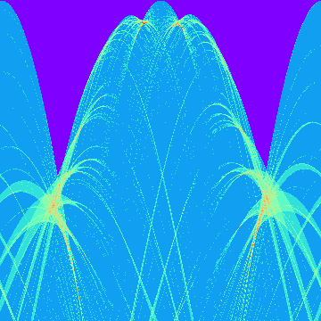<br><sub>log</sub></td></tr>
  <tr><th colspan="2"><code>jet</code></th><th colspan="2"><code>turbo</code></th><th colspan="2"><code>gist_ncar</code></th></tr>
  <tr><td align="center">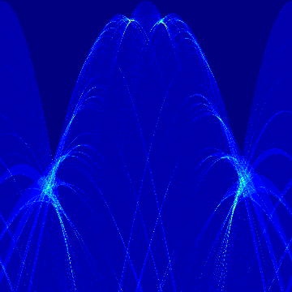<br><sub>linear</sub></td><td align="center">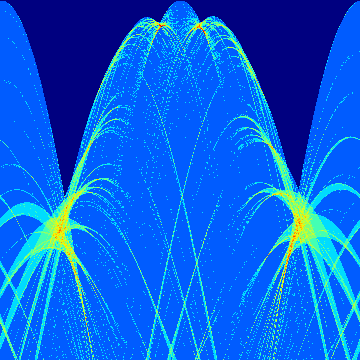<br><sub>log</sub></td><td align="center">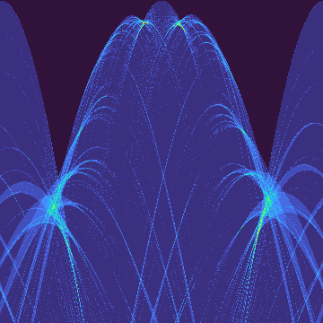<br><sub>linear</sub></td><td align="center">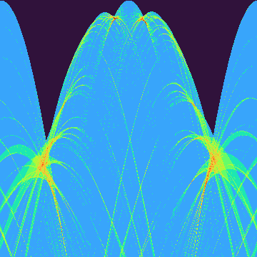<br><sub>log</sub></td><td align="center">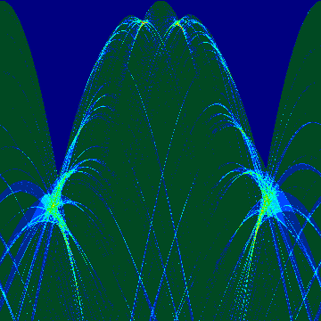<br><sub>linear</sub></td><td align="center">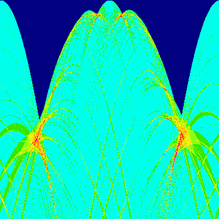<br><sub>log</sub></td></tr>
</table>

### 18. Momocs Export

Writes every leaf in the formats read by the R morphometrics packages
[Momocs](https://github.com/MomX/Momocs) (legacy, still on CRAN) and its rewrite
[Momocs2](https://github.com/MomX/Momocs2), which imports through
[Momit](https://github.com/MomX/Momit). It reads the Reporter's holes-filled leaf masks and writes,
under `reports/Leaf_Momocs/`:

- one JPG per leaf: the leaf in black on white, padded by a white border;
- `momocs_fac.csv`: one row per JPG (sheet, leaf, detection box, rotation, scale), the grouping table;
- `momocs_outlines.json`: every outline in the run in Momit's JSON format, plus one such file per
  sheet in `Momit_JSON/`.

Either route loads the same outlines:

```r
library(Momocs)
coo <- import_jpg(list.files("reports/Leaf_Momocs", "jpg$", full.names = TRUE))
fac <- read.csv("reports/Leaf_Momocs/momocs_fac.csv")
leaves <- Out(coo, fac = fac[match(names(coo), fac$id), ])

tb <- Momit::from_json("reports/Leaf_Momocs/momocs_outlines.json")   # a Momocs2 table
leaves <- Momit::to_Momocs(tb)                                       # or a legacy Momocs Out
```

The image format is fixed because each alternative goes wrong in R without an error. Unpadded masks
that touch the image edge, white-on-black masks, open holes, and coordinates with y increasing
downward all import as the wrong shape. Outlines start at the lowest point (the base of a tip-up
leaf) and run clockwise, as Momocs `import_jpg` traces them.

`modules.momocs.include_petiole` (default off) traces the lamina plus petiole and leaves out leaves
with no petiole. `oriented` (default on) uses LM3's tip-up leaves; for those, run
`efourier(..., norm = FALSE)`, because the default normalization turns them on their side. Momocs
1.5.0's `coo_baseline` rotates in the wrong direction unless a shape already lies along the
x axis; Momocs2's version is correct.

If you use these outputs, please cite:

> Bonhomme, V., Picq, S., Gaucherel, C., & Claude, J. (2014). Momocs: Outline analysis using R.
> *Journal of Statistical Software*, 56(13), 1–24. <https://doi.org/10.18637/jss.v056.i13>

---

## Module Outputs

What each module writes, in pipeline order: its database tables and specimen columns, and the
report folders and CSVs built from them. The Model column links every Hugging Face model the
stage can run (default first; see [Models](#models) to install an alternate), or says it is pure
CPU code.

| Module | Model | Output |
|---|---|---|
| 1. [MP Conversion Factor](#1-mp-conversion-factor) | [`phyloforfun/lm3_mp_conversion_factor__sqrt_fit`](https://huggingface.co/phyloforfun/lm3_mp_conversion_factor__sqrt_fit) (CPU; runs before any image is decoded) | `specimen.cf_px_per_cm_predicted_by_mp` |
| 2. [Archival Detector](#2-archival-detector) | [`phyloforfun/lm3_archival_detector__yolo26x_det_1280`](https://huggingface.co/phyloforfun/lm3_archival_detector__yolo26x_det_1280) (default)<br>[`phyloforfun/lm3_archival_detector__yolo26n_det_640`](https://huggingface.co/phyloforfun/lm3_archival_detector__yolo26n_det_640) | `archival_detection` table; `Crops/RGB__<class>/` and `detections.csv` |
| 3. [Plant Detector](#3-plant-detector) | [`phyloforfun/lm3_plant_detector__yolo26x_det_1280`](https://huggingface.co/phyloforfun/lm3_plant_detector__yolo26x_det_1280) (default)<br>[`phyloforfun/lm3_plant_detector__yolo26n_det_640`](https://huggingface.co/phyloforfun/lm3_plant_detector__yolo26n_det_640) | `plant_detection` table; `Leaf_Original/Leaf_BBox/` for leaves, `Crops/RGB__<class>/` for everything else |
| 4. [Specimen Segmenter](#4-specimen-segmenter) | [`phyloforfun/lm3_specimen_segmenter__unetpp_effb7_1024`](https://huggingface.co/phyloforfun/lm3_specimen_segmenter__unetpp_effb7_1024) (default)<br>[`phyloforfun/lm3_specimen_segmenter__birefnet_hr_swinl_1024`](https://huggingface.co/phyloforfun/lm3_specimen_segmenter__birefnet_hr_swinl_1024)<br>[`phyloforfun/lm3_specimen_segmenter__yolo26x_seg_1280`](https://huggingface.co/phyloforfun/lm3_specimen_segmenter__yolo26x_seg_1280) | `specimen_mask` table; `Specimen_Masks/*_Specimen/` and `Overlay/Overlay_Specimen_Segmentation/` |
| 5. [Phenology Detector](#5-phenology-detector) | none (CPU) | `phenology` table; `has_leaves` / `has_flowers` / `has_fruits` on the specimen; `Data/phenology.csv` |
| 6. [Ruler Classifier](#6-ruler-classifier) | ensemble of all three:<br>[`phyloforfun/lm3_ruler_classifier_ensemble__yolo26x_cls_224`](https://huggingface.co/phyloforfun/lm3_ruler_classifier_ensemble__yolo26x_cls_224)<br>[`phyloforfun/lm3_ruler_classifier_ensemble__yolo26n_cls_224`](https://huggingface.co/phyloforfun/lm3_ruler_classifier_ensemble__yolo26n_cls_224)<br>[`phyloforfun/lm3_ruler_classifier_ensemble__dinov2_frozen_mlp`](https://huggingface.co/phyloforfun/lm3_ruler_classifier_ensemble__dinov2_frozen_mlp) | `ruler_classification` table; `specimen.ruler_class_type` |
| 7. [Ruler Conversion Factor](#7-ruler-conversion-factor) | none (CPU) | `ruler_CF_lattice` tables; `specimen.cf_px_per_cm` + `cf_source`; `Overlay/Overlay_Ruler_Lattice/` and `Data/ruler_conversion_factor.csv` (the verdict and why) |
| 8. [Leaf Segmenter](#8-leaf-segmenter) | [`phyloforfun/lm3_leaf_segmenter__yolo26x_seg_1024`](https://huggingface.co/phyloforfun/lm3_leaf_segmenter__yolo26x_seg_1024) | `leaf_segmentation` table; `Specimen_Masks/*__Leaf/` per leaf and per sheet |
| 9. [Morphology](#9-morphology) | none (CPU) | `leaf_morphology` table; the green rotated boxes on the summary overlay |
| 10. [Landmark Detector](#10-landmark-detector) | [`phyloforfun/lm3_landmark_detector__yolo26x_pose_640`](https://huggingface.co/phyloforfun/lm3_landmark_detector__yolo26x_pose_640) | `leaf_landmark` table (specimen and crop coordinates); `Data/landmarks.csv` |
| 11. [Landmark Measurements](#11-landmark-measurements) | none (CPU) | `leaf_landmark_measurement` table; the cyan/white/black lines and the measurement block on `Overlay/Overlay_Landmarks/` |
| 12. [Leaf Orientation](#12-leaf-orientation) | none (CPU) | `oriented_leaf_rotation_angle_degreesCW` and `oriented_leaf_success` on `leaf_morphology` |
| 13. [Petiole Width](#13-petiole-width) | none (CPU) | `leaf_petiole` table (`width_px`, `length_px`, `touches_leaf`); `Overlay/Overlay_Petiole/` |
| 14. [Bilateral Symmetry](#14-bilateral-symmetry) | none (CPU) | `bilateral_symmetry` table; `Leaf_Data/Bilateral_Symmetry/` |
| 15. [Metric Grounding](#15-metric-grounding) | none (CPU) | the `_cm` and `_cm2` columns in `Data/leaf_measurements.csv`, with `cf_source` on each row saying where the factor came from |
| 16. [Reporter](#16-reporter) | none | everything under `reports/`; see [Outputs](#outputs) |
| 17. [Shape (ECT)](#17-shape-ect) | none (CPU) | `leaf_ect` table; `Leaf_Data/Oriented_Leaf_ECT/`, `Oriented_Leaf_Radial_ECT/`, `Oriented_Leaf_Radial_ECT_Overlay/`, `Coordinates/*.h5` |
| 18. [Momocs Export](#18-momocs-export) | none (CPU) | `leaf_momocs` table; `Leaf_Momocs/*.jpg`, `momocs_fac.csv`, `momocs_outlines.json`, `Momit_JSON/<stem>.json` |

---

## Outputs

### The `reports/` folder

```
reports/
  Overlay/
    Overlay_Summary/               <stem>__Overlay.jpg              masks + boxes + landmarks + petiole bands
    Overlay_Landmarks/             <stem>__LM-leaf__x_y_x_y.jpg     per leaf
    Overlay_Petiole/               <stem>__PET-leaf__x_y_x_y.jpg    per leaf
    Overlay_Specimen_Segmentation/ <stem>__SpecimenSeg.jpg
    Overlay_Ruler_Lattice/         <stem>__RulerLattice.png         ruler QC panel
  Leaf_Original/                   7 products per leaf, as mounted  (og-)
  Leaf_Oriented/                   the same 7, rotated tip-up       (or-)
  Crops/RGB__<class>/              every non-leaf detection
  Specimen_Masks/                  whole-sheet and per-leaf masks, binary and RGB
  Leaf_Data/                       Bilateral_Symmetry/, Oriented_Leaf_ECT/, ..., Coordinates/
  Leaf_Momocs/                     <stem>__or-MOMOCS-lamina__x_y_x_y.jpg per leaf, momocs_fac.csv,
                                   momocs_outlines.json, Momit_JSON/<stem>.json per sheet
  Data/                            CSV export (below)
```

### The CSV tables

| File | One row per |
|---|---|
| `leaf_measurements.csv` | **leaf** — every morphology, landmark, petiole and symmetry measurement, plus the identifiers to trace it back. Start here. |
| `specimen_summary.csv` | input image, with per-sheet roll-ups |
| `phenology.csv` | sheet, in LeafMachine2's layout |
| `detections.csv` | detection box, both detectors |
| `landmarks.csv` | predicted keypoint (31 per leaf) |
| `ruler_conversion_factor.csv` | sheet: the conversion-factor verdict and why |
| `run_stages.csv`, `stage_errors.csv` | pipeline stage; per-image failure |
| `data_dictionary.csv` | every column above: file, units, meaning |

Two things to know before analyzing: every `_px` value is in the **working frame** (divide by
`work_scale` for original-image pixels), and `_cm` columns are **empty unless a ruler conversion
factor was published** for that sheet; an empty cell means "not measured", never zero.

### File naming

Every file is named `<stem>__<ID>__x_y_x_y.<ext>`, where `x_y_x_y` is the detection box in the
working frame, so any crop can be placed back on its parent by filename alone. Every `ID` is
unique across the whole run, so the entire `reports/` tree can be flattened into one folder
without a collision. Class → friendly-name mapping and the prefixes are editable under `naming`.

---

## Postprocessing Tools

Small, standalone tools that run on a finished run. They have their own settings file
(`postprocessing_settings.yaml`) and their own GUI tab.

**3D-printable STL from a mask.** Extrudes any binary mask PNG (a lamina silhouette, a whole
specimen mask) into a flat `.stl` slab of a chosen length and thickness, holes filled, boundary
smoothed. The same tool runs in the browser at [leafmachine.org](https://leafmachine.org) with no
upload.

```bash
uv run --frozen --no-sync python -m leafmachine3.postprocessing.generate_stl_from_mask --config postprocessing_settings.yaml --paths <mask.png>
```

**Leaf collage.** Tiles a run's best leaves, ranked by the bilateral-symmetry archetype score,
into the outline of one primary mask: a leaf built out of leaves. Reads existing Reporter output
only; nothing is re-segmented.

```bash
uv run --frozen --no-sync python -m leafmachine3.postprocessing.generate_leaf_collage --config postprocessing_settings.yaml --run-dir runs/demo --primary-mask <mask.png>
```

---

## Models

Every model is an exported end-to-end ONNX graph run by onnxruntime, published on Hugging Face
with a model card (training data, metrics, license) and a manifest of file hashes. `lm3 models
install` fetches the defaults; alternates install on request and the command prints the settings
lines that select them.

```bash
uv run --frozen --no-sync lm3 models install --list-alternates
uv run --frozen --no-sync lm3 models install --model specimen_segmenter=birefnet_hr_swinl_1024
uv run --frozen --no-sync lm3 models verify
```

| Module | Default | Alternates | License |
|---|---|---|---|
| Archival Detector | [yolo26x_det_1280](https://huggingface.co/phyloforfun/lm3_archival_detector__yolo26x_det_1280) | [yolo26n_det_640](https://huggingface.co/phyloforfun/lm3_archival_detector__yolo26n_det_640) | AGPL-3.0 |
| Plant Detector | [yolo26x_det_1280](https://huggingface.co/phyloforfun/lm3_plant_detector__yolo26x_det_1280) | [yolo26n_det_640](https://huggingface.co/phyloforfun/lm3_plant_detector__yolo26n_det_640) | AGPL-3.0 |
| Specimen Segmenter | [unetpp_effb7_1024](https://huggingface.co/phyloforfun/lm3_specimen_segmenter__unetpp_effb7_1024) | [birefnet_hr_swinl_1024](https://huggingface.co/phyloforfun/lm3_specimen_segmenter__birefnet_hr_swinl_1024), [yolo26x_seg_1280](https://huggingface.co/phyloforfun/lm3_specimen_segmenter__yolo26x_seg_1280) | Apache-2.0 (MIT, AGPL-3.0) |
| Ruler Classifier | ensemble: [yolo26x_cls_224](https://huggingface.co/phyloforfun/lm3_ruler_classifier_ensemble__yolo26x_cls_224), [yolo26n_cls_224](https://huggingface.co/phyloforfun/lm3_ruler_classifier_ensemble__yolo26n_cls_224), [dinov2_frozen_mlp](https://huggingface.co/phyloforfun/lm3_ruler_classifier_ensemble__dinov2_frozen_mlp) | | AGPL-3.0 / Apache-2.0 |
| Leaf Segmenter | [yolo26x_seg_1024](https://huggingface.co/phyloforfun/lm3_leaf_segmenter__yolo26x_seg_1024) | | AGPL-3.0 |
| Landmark Detector | [yolo26x_pose_640](https://huggingface.co/phyloforfun/lm3_landmark_detector__yolo26x_pose_640) | | AGPL-3.0 |
| MP Conversion Factor | [sqrt_fit](https://huggingface.co/phyloforfun/lm3_mp_conversion_factor__sqrt_fit) | | MIT |

Training images and annotations are not distributed. The detector, segmenter, and landmark data
sets were annotated in Labelbox, extending the 494,766-annotation LeafMachine2 effort; the
specimen-segmenter targets are machine-generated.

---

## Related Projects and Citation

- **LeafMachine2** — [github.com/Gene-Weaver/LeafMachine2](https://github.com/Gene-Weaver/LeafMachine2).

  > Weaver, W. N., & Smith, S. A. (2023). From leaves to labels: Building modular machine learning
  > networks for rapid herbarium specimen analysis with LeafMachine2. *Applications in Plant
  > Sciences*, 11(5), e11548. <https://doi.org/10.1002/aps3.11548>

- **FieldPrism** — [fieldprism.org](https://fieldprism.org/): field images with photogrammetric
  markers and QR codes; LeafMachine3 measures its rectified sheets (see [FieldPrism sheets](#fieldprism-sheets)).

  > Weaver, W. N., & Smith, S. A. (2023). FieldPrism: A system for creating snapshot vouchers from
  > field images using photogrammetric markers and QR codes. *Applications in Plant Sciences*, 11(5),
  > e11545. <https://doi.org/10.1002/aps3.11545>

- **VoucherVision** — [github.com/Gene-Weaver/VoucherVision](https://github.com/Gene-Weaver/VoucherVision):
  label transcription with large language models; the Archival Detector's label crops are its input.
- **leafmachine.org** — <https://leafmachine.org>

A LeafMachine3 paper is in preparation. Until it is published, please cite the LeafMachine2 paper
above and link this repository:

> Weaver, W. N. (2026). LeafMachine3. <https://github.com/Gene-Weaver/LeafMachine3>

---

## License

LeafMachine3 is free software under the **GNU General Public License v3.0**; see
[LICENSE](LICENSE). As an additional term under section 7(b) of that license, copies and
derivative works must keep the author attribution in [NOTICE](NOTICE).

`leafmachine3/inference/ultra_replacements.py` ports code from Ultralytics and remains under the
AGPL-3.0 (see NOTICE). Model weights are not in this repository; each published model's license
is on its Hugging Face model card.
