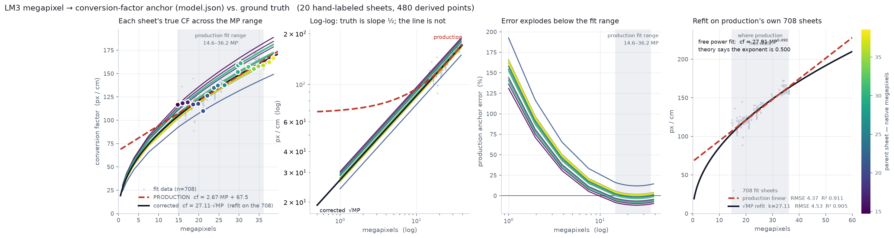

# MP_range — does the megapixel → conversion-factor anchor hold outside its fit range?

`specimen.cf_px_per_cm_predicted_by_mp` is produced by a one-feature **linear** fit,
`cf = 2.674·MP + 67.52`, trained on 708 sheets spanning 14.6–36.2 MP (R² = 0.91). That prediction
is not cosmetic: the lattice ruler-CF stage uses it as the **MP anchor**, and the anchor is what
gates whether a sheet's measured CF is published at all
(`leafmachine3/inference/ruler_lattice/sheet_cf.py`). A wrong anchor withholds good CFs and admits
bad ones.

This experiment measures the truth directly and asks how far the line can be trusted.

## Method

1. **`label_server.py`** picks 20 sheets spanning the corpus MP range — binned on MP *value*, not
   rank, because this corpus piles up in 18–21 MP and rank sampling would leave the high end (where
   the fit extrapolates) represented by one or two sheets. It serves a zoomable viewer with an 8×
   magnifier; you click two points 1 cm apart on each sheet's ruler. Points are recorded in original
   pixel coordinates, so `px_per_cm` is that sheet's true CF at native resolution.

   A live *implied sheet size* readout catches the mis-click that matters: mark 1 inch instead of
   1 cm and it reads ~12 cm wide instead of ~30, in red, before the bad point reaches the plot.

2. **`expand_and_plot.py`** renders every sheet across a common ladder — the 24 rungs are every real
   native MP in the set plus four geometric steps down to 1 MP — giving 480 points from 20
   measurements.

   **The derived CFs are exact, not estimates.** A uniform resize scales every distance by the same
   factor, so it scales the CF by that factor. A sheet measuring 116.60 px/cm at 2946×5000 measures
   exactly 58.30 px/cm at 1473×2500. CF is computed from the **actual integer output dimensions**,
   not the requested target, so resize rounding is carried through rather than assumed away.

## Result



| | mean \|err\| | p95 | max |
|---|---|---|---|
| production anchor, **inside** 14.6–36.2 MP | 3.8 % | 11.6 % | 16.1 % |
| production anchor, **outside** it | **52.4 %** | 161.5 % | 192.6 % |
| production anchor, all 480 rungs | 15.9 % | 94.8 % | 192.6 % |
| `cf = 27.37·√MP` refit on the same 20 sheets | **3.8 %** | 10.1 % | 14.1 % |

**The functional form is wrong.** A sheet of fixed physical size imaged at 4× the pixel count has
2× the px/cm — CF is proportional to **√MP**, not to MP. The log-log panel makes it unmissable:
every sheet is a straight line of slope ½ and the production line is visibly curved against them.

**The intercept is the expensive part.** `+67.52` means the line predicts ~68 px/cm for a
zero-pixel image, where the truth is 0. Inside the training band the slope term dominates and the
error stays near 4 %; below it the intercept takes over and the anchor is wrong by up to 193 %.

**Inside its range the line is fine.** This is not an argument that the anchor is broken in normal
operation — herbarium originals mostly land in 15–40 MP. It is an argument about what happens off
the edge, and the √MP form costs nothing to adopt: one parameter instead of two, equal accuracy
inside the band, and it degrades gracefully outside it.

This matters because it is reachable in practice. In the 22-sheet `test_CF_overlay` run, **9 sheets
fell outside the fit range** (2.6 to 101.1 MP). One of them — a 3.0 MP sheet — drew an anchor that
implied a 19.9 cm herbarium sheet, was rejected by the plausibility guard, and published its CF on
peer agreement alone with no absolute reference.

## The refit, on production's own 708 sheets

| form | params | RMSE | R² | mean \|%\| | p95 |
|---|---|---|---|---|---|
| `cf = a·MP + b` (production) | a=2.6745, b=67.519 | **4.37** | **0.9113** | 2.17 % | 6.69 % |
| `cf = k·√MP` | k=27.1121 | 4.53 | 0.9048 | 2.30 % | 7.50 % |
| `cf = k·√MP + c` | k=26.977, **c=0.637** | 4.53 | 0.9049 | 2.28 % | 7.48 % |
| `cf = a·MP^b` (b free) | a=27.912, **b=0.4904** | 4.54 | 0.9044 | 2.24 % | 7.45 % |

Two of those rows are the argument, and neither was told what to find:

- **The free exponent lands on 0.4904.** Nothing constrained it; theory says exactly 0.5.
- **The fitted intercept lands on 0.637 px/cm.** The data does not want the `+67.52` — it is an
  artifact of forcing a straight line through a narrow window of a curve.

Inside the training band the linear form is *marginally* better (RMSE 4.37 vs 4.53) — it has two
free parameters instead of one and spends the second fitting local curvature. That is the whole
advantage, and it reverses immediately outside the band:

| MP | production linear | `27.11·√MP` |
|---|---|---|
| 1 | 70.19 | **27.11** |
| 3 | 75.54 | **46.96** |
| 8 | 88.91 | **76.68** |
| 25 | 134.38 | 135.56 |
| 60 | 227.99 | **210.01** |
| 101 | 337.64 | **272.47** |

## The consequence: the anchor no longer needs the original image

LM3 needs the anchor in the **working** frame. Today it predicts in the original frame and
multiplies by `work_scale`, which is what makes `specimen.original_width/height` load-bearing.
Under the square-root form that round trip disappears:

```
MP_work        = MP_orig · ws²           (area scales as the square of a linear resize)
√MP_work       = √MP_orig · ws
k·√MP_orig · ws  ==  k·√MP_work          ← ws cancels exactly
```

Verified on the 20 sheets (`scale_equivariance_check`, printed by `expand_and_plot.py`): predicting
in the original frame and scaling, versus predicting straight from the working image, agree to
**0.0117 % worst case** — pure integer-rounding noise. The same comparison for the linear form is
**20.1 % off on average, 23.2 % at worst**.

The linear form cannot be moved into the working frame at all, and it is specifically the
**intercept** that forbids it: scaling `a·MP + b` by `ws` scales `b` too, while evaluating it at
`MP_work` does not. Only a function homogeneous in the linear scale factor survives a frame change,
and `k·√MP` is the one the physics already asked for.

So adopting √MP removes the last dependency on the original image anywhere in the pipeline.
Combined with the Reporter now rendering in the working frame, `original_width` / `original_height`
become pure provenance — recorded, never consumed.

## Gate evaluation on the 708 (`gate_eval.py`, `dissent_eval.py`)

The 708 rows are 549 unique sheets with **human** ruler measurements (`ruler_manual.csv` `cm_1_avg`),
so they are independent ground truth for the lattice, not its own output fed back. 153 of them were
measured twice by hand; those repeats disagree by **1.29 % on average**, which is the noise floor any
verdict below has to be read against.

### The anchor swap is a wash on in-range data

| | linear anchor | √MP anchor |
|---|---|---|
| anchor error vs human truth | 2.2 % mean | 2.3 % mean |
| published | 523 / 549 | 520 / 549 |
| published CF error | 0.7 % mean, p95 3.1 % | 0.7 % mean, p95 3.2 % |
| bad publishes (>10 %) | 1 | 1 |

**546 of 549 decisions are identical.** The three that moved were newly *withheld* under √MP, all
with good measurements, all at 14.6–15.0 MP — the very bottom of the band, where the linear fit's
second parameter buys the most local accuracy. This corpus lies entirely inside 14.6–36.2 MP, so it
cannot test the regime where √MP wins; it only confirms the two are equivalent where the old fit was
optimized.

A hypothesis that did **not** pan out: since the gate compares `|log(measured/anchor)|`, `k` ought to
be fit in log space to minimize *relative* rather than absolute error. Refitting that way moves `k`
by −0.04 % and changes nothing. The band-wise residual (−2.3 % at 14–18 MP, +2.6 % at 21–25 MP) is
physical sheet-size variation, not a scaling error, and no one-parameter MP model can remove it.

### The real cost is the dissent veto

Of the 26 sheets the gate withheld, **22 had a measurement within 10 % of truth** — only 4 were
genuinely bad. **19 of those 22 were vetoed by a single dissenting crop while the MP anchor agreed
with the winner.** The rule is unconditional:

```python
dissent = [every live non-winning crop with weight >= DISAGREEMENT_FLOOR]
if dissent: confidence = "low"          # -> the sheet publishes nothing
```

`dissent_eval.py` replays alternative rules against the stored records — no production code changes,
and the baseline replay is verified to reproduce **549/549** shipped decisions before any variant is
believed.

| variant | published | correct | BAD | missed good | net |
|---|---|---|---|---|---|
| baseline (production) | 523 | 522 | 1 | 22 | — |
| **anchor overrules dissent** | **542** | **541** | **1** | **3** | **+19 / +0 bad** |
| dissenter must be plausible | 535 | 534 | 1 | 10 | +12 / +0 |
| dissenter must outweigh winner | 531 | 530 | 1 | 14 | +8 / +0 |
| harmonic dissent ignored | 526 | 525 | 1 | 19 | +3 / +0 |

Identical net effect (+19 / +0) under **both** anchors, so it is not tuned to one. The compound
variants ("anchor overrules + harmonic", "+ plausible") score exactly the same as the simple rule —
the extra conditions buy nothing, so the smallest change is also the best one.

The 19 recovered sheets land at **1.29 % mean error, max 3.61 %, none worse than 5 %** — the same
accuracy as the human repeats.

**Why it is safe.** Of the 20 sheets that have a dissenting crop at all, the veto was blocking a good
CF on 19 and a bad one on 1 — and that one stays blocked, because the anchor does not confirm it
either. Zero bad CFs leak through. The change does not weaken the anchor test at all; it only stops
a dissenting sibling from overriding a reading the anchor has already independently confirmed, which
is what the module docstring already claims the anchor is for. The DBG failure mode (two crops
agreeing with each other and both 2× wrong) is still caught, because it was the *anchor* that caught
it, and the anchor check is untouched.

**The honest limit:** only 20 of 549 sheets exercise dissent at all, so the risk side is thinly
sampled. The 3 sheets still withheld fail for an unrelated reason — `confidence = "medium"`, with the
anchor 20–23 % off (outside half a rung, inside `anchor_tol`) — which the dissent rule cannot reach.

The single remaining bad publish (`US_2592231711`, +14.2 %) is identical in every variant and is a
*measurement* failure, not a gate failure: the reading itself was 14.2 % off, just outside the
±11–12 % window the gate can see.

## Files

| | |
|---|---|
| `label_server.py` | selection + local labeling server (`python -m leafmachine3.modules.experiments.MP_range.label_server`) |
| `app.html` | the viewer: wheel zoom, 8× magnifier, prev/next, finish |
| `manifest.json` | the 20 chosen sheets — regenerate with `--reselect` |
| `labels.json` | your clicks, autosaved on every change |
| `expand_and_plot.py` | the ladder, the CSV, the figure, the error table |
| `mp_cf_grid.csv` | 480 rows: parent, dims, MP, CF, scale, kind |
| `comparison.png` / `comparison_dark.png` | the figure |

`expand_and_plot.py --write-images` also materializes every rung as a JPEG (~480 files, several GB)
for anyone who wants to re-measure or refit on real pixels. The plot does not need them.

## Caveats

- 20 sheets is enough to establish the *form* (each contributes a full curve, and the curves are
  parallel) but not to refit production coefficients — `k = 27.37` is this sample's mean physical
  sheet size and aspect, and should be refit on the full 708 before it replaces anything.
- Upscaling invents no detail. It is the correct way to place a known sheet at a higher MP for this
  question, and it is not a claim that an upscaled image is as measurable as a native one.
- One sheet (`DBG_2242367910`, 110.04 px/cm at 21 MP) sits below the pack because it is physically
  larger — 34 × 51 cm implied. It is real data, and it is exactly the spread a single-feature model
  cannot capture: MP alone cannot know how big the paper is.
